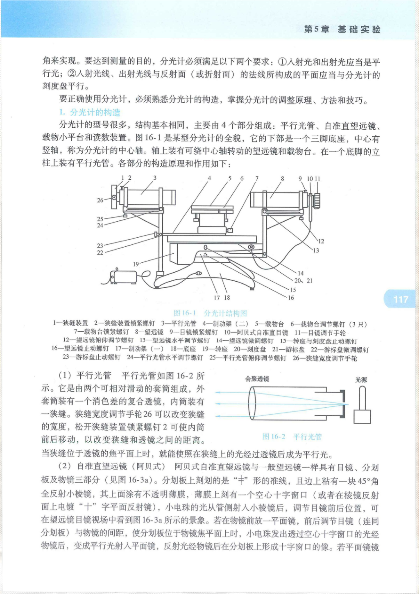
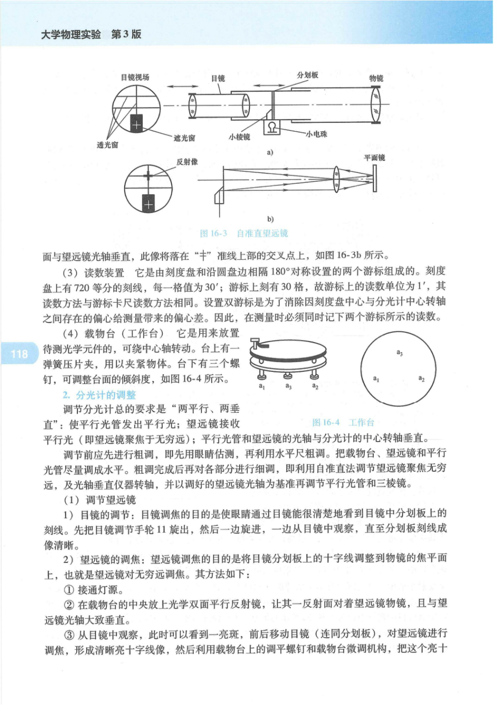
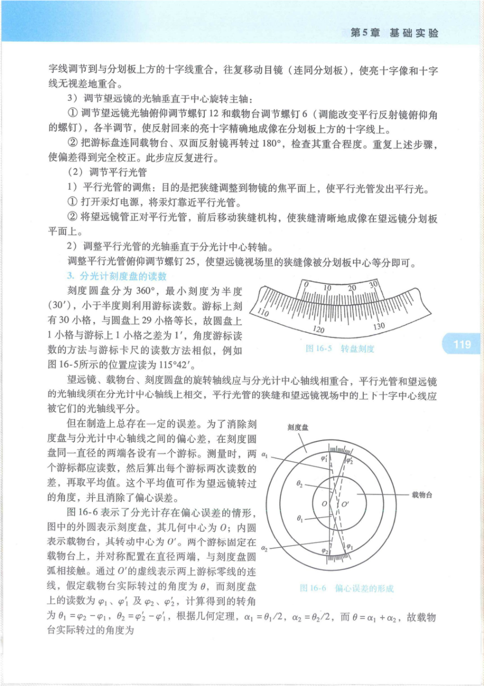
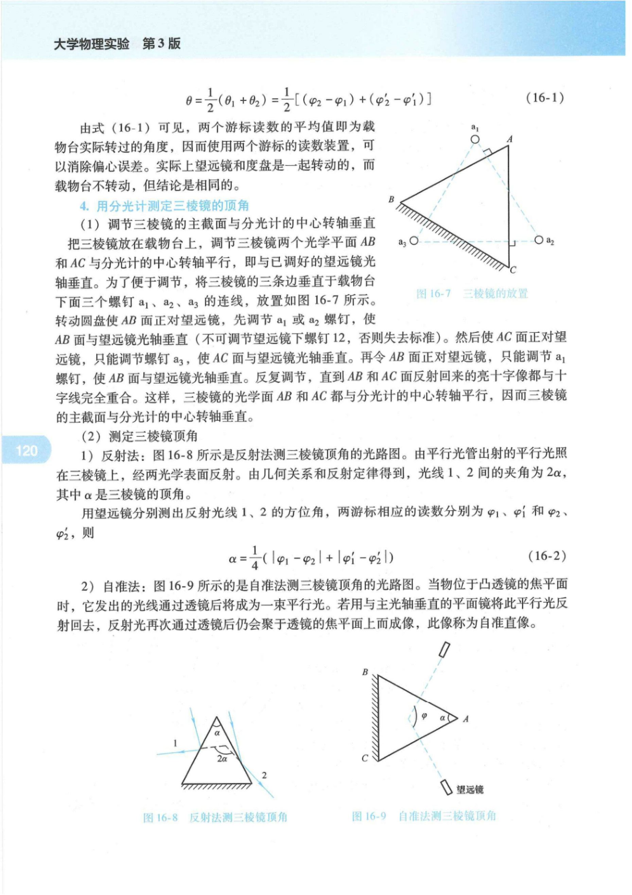
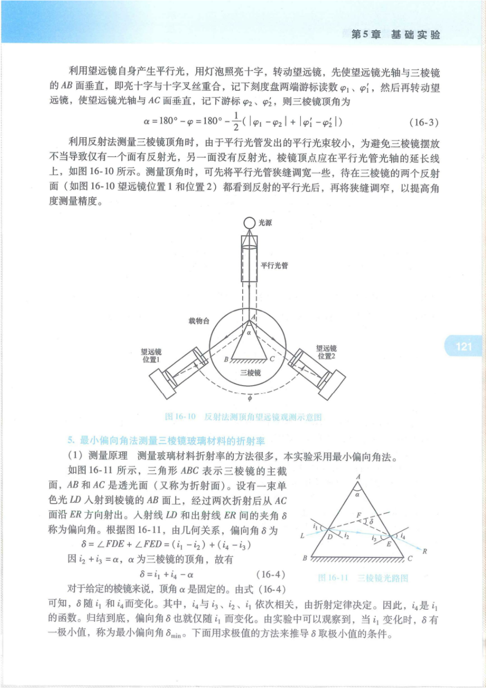
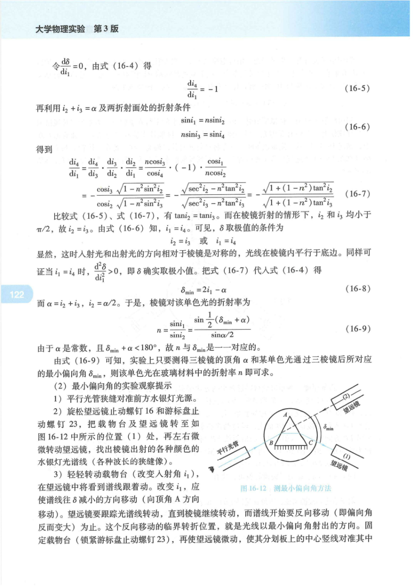
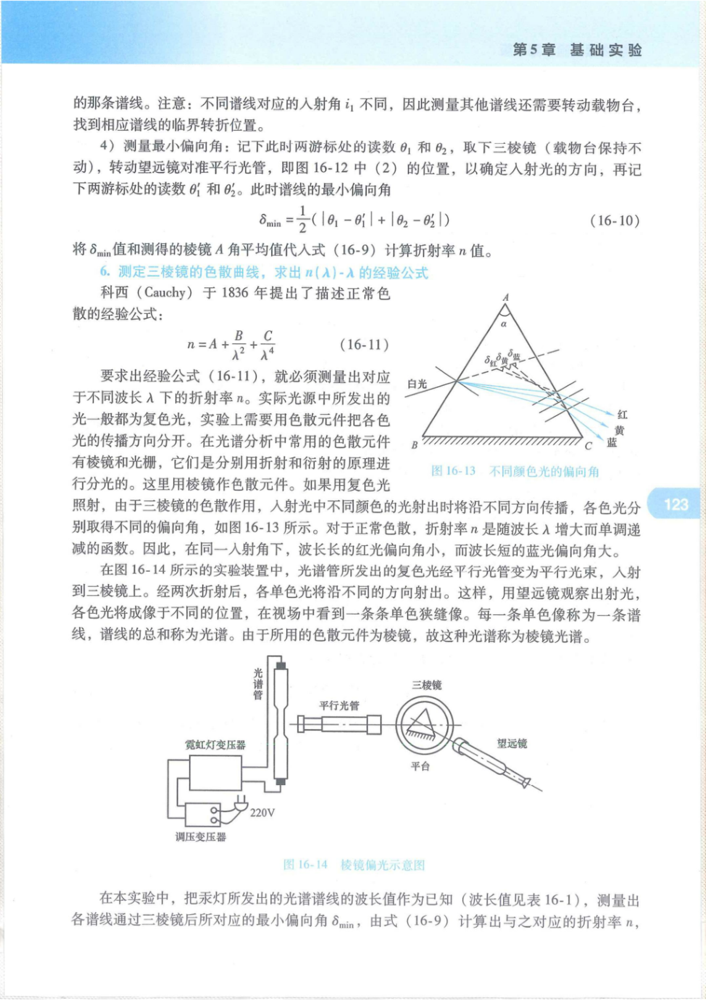
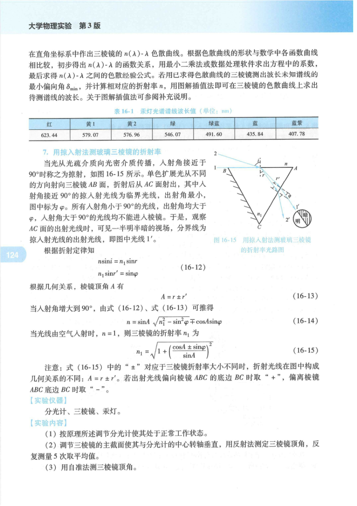
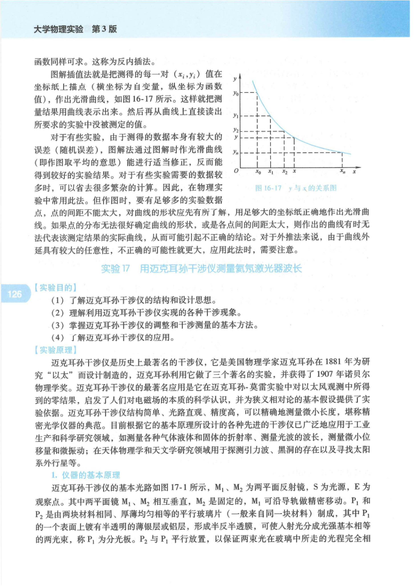

# 分光计

> **实验16 分光计的调整与使用** —— 大学物理实验（第3版）第3部分 光学基础实验

---

## 实验目的

1. 了解分光计的结构和基本功能。
2. 理解分光计的测量原理。
3. 掌握分光计的调节和使用规范。
4. 探究分光计的应用技术和方法。

---

## 实验原理

### 1. 分光计概述

分光计，又称光学测角仪，是一种用于分光测角的光学实验仪器。它基于光的反射、折射、衍射、干涉和偏振原理，进行角度测量。主要应用包括：

- 利用光的**反射**测量棱镜的角度。
- 利用光的**折射**测量棱镜的最小偏向角，从而计算棱镜的折射率和色散率。
- 与**光栅**配合，进行光的衍射实验，测量光波波长。
- 与**偏振片、波片**配合，进行光的偏振实验。

> **重点**：用分光计测量角度，主要依据光的反射和折射定律，通过测量入射光和出射光传播方向的方位角来实现。为达到测量目的，分光计必须满足两个要求：
> 1. 入射光和出射光应为平行光。
> 2. 入射光线、出射光线与反射面（或折射面）法线所构成的平面应与分光计的刻度盘平行。

### 2. 分光计的构造

分光计的型号多样，但结构基本相同，主要由 **4个部分** 组成：平行光管、自准直望远镜、载物台和读数装置。

!!! note "仪器/实物图：分光计结构图"
    页2, 分光计全貌结构图, 标注1-26各部件

分光计结构图部件说明（图16-1）：

| 编号 | 部件名称 | 编号 | 部件名称 |
|:---:|---------|:---:|---------|
| 1 | 狭缝装置 | 14 | 望远镜微调螺钉 |
| 2 | 狭缝装置锁紧螺钉 | 15 | 转座与刻度盘止动螺钉 |
| 3 | 平行光管 | 16 | 望远镜止动螺钉 |
| 4 | 制动架（二） | 17 | 制动架（一） |
| 5 | 载物台 | 18 | 底座 |
| 6 | 载物台调节螺钉（3只） | 19 | 转座 |
| 7 | 载物台锁紧螺钉 | 20 | 刻度盘 |
| 8 | 望远镜 | 21 | 游标盘 |
| 9 | 目镜锁紧螺钉 | 22 | 游标盘微调螺钉 |
| 10 | 阿贝式自准直目镜 | 23 | 游标盘止动螺钉 |
| 11 | 目镜调节手轮 | 24 | 平行光管水平调节螺钉 |
| 12 | 望远镜俯仰调节螺钉 | 25 | 平行光管俯仰调节螺钉 |
| 13 | 望远镜水平调节螺钉 | 26 | 狭缝宽度调节手轮 |

分光计的下部是一个三脚底座，中心设有竖轴，称为分光计的**中心轴**。轴上装有可绕中心轴转动的望远镜和载物台。在一个底脚的立柱上装有平行光管。

#### （1）平行光管

!!! note "仪器/实物图：平行光管结构"
    页2, 平行光管结构示意图

平行光管由两个可相对滑动的套筒组成。外套筒装有一个消色差的复合透镜，内筒装有一个狭缝。狭缝宽度调节手轮（26）可改变狭缝的宽度，松开狭缝装置锁紧螺钉（2）可使内筒前后移动，以改变狭缝和透镜之间的距离。

> **重点**：当狭缝位于透镜的焦平面上时，照在狭缝上的光经透镜后将成为**平行光**。

#### （2）自准直望远镜（阿贝式）

!!! note "仪器/实物图：自准直望远镜"
    页3, 自准直望远镜结构及视场图

阿贝式自准直望远镜由目镜、分划板及物镜三部分组成。分划板上刻有"十"形准线，旁边粘有一块45°角全反射小棱镜，其表面涂有不透明薄膜，薄膜上刻有一个空心十字窗口。小电珠的光从管侧射入小棱镜后，调节目镜前后位置，可在望远镜目镜视场中观察到景象。

> **重点**：若在物镜前放置一平面镜，前后调节目镜（连同分划板）与物镜的间距，使分划板位于物镜焦平面上时，小电珠发出透过空心十字窗口的光经物镜后变为平行光射入平面镜，反射光经物镜后在分划板上形成十字窗口的像。若平面镜镜面与望远镜光轴垂直，此像将落在"十"准线上方的交叉点上。

#### （3）读数装置

读数装置由刻度盘和沿圆盘边相隔180°对称设置的两个游标组成。

- 刻度盘上有 **720等分** 的刻线，每一格值为 **30′**（半度）。
- 游标上刻有 **30格**，故游标上的读数单位为 **1′**。
- 读数方法与游标卡尺读数方法相同。

> **易错**：设置双游标是为了消除因刻度盘中心与分光计中心转轴之间存在偏心给测量带来的**偏心差**。测量时必须同时记录两个游标所示的读数。

#### （4）载物台（工作台）

!!! note "仪器/实物图：载物台"
    页3, 载物台/工作台结构图

载物台用于放置待测光学元件，可绕中心轴转动。台上设有一弹簧压片夹，用以夹紧物体。台下有三个螺钉，可调整台面的倾斜度。

### 3. 分光计的调整

> **重点**：调节分光计的总要求是"**两平行、两垂直**"：
> - 使平行光管发出平行光。
> - 望远镜接收平行光（即望远镜聚焦于无穷远）。
> - 平行光管的光轴与分光计的中心转轴垂直。
> - 望远镜的光轴与分光计的中心转轴垂直。

调节前应先进行**粗调**：先用眼睛估测，再利用水平尺粗调，将载物台、望远镜和平行光管尽量调成水平。粗调完成后进行**细调**。

#### （1）调节望远镜

**1）目镜的调节**：目镜调焦的目的是使眼睛通过目镜能清晰地看到目镜中分划板上的刻线。先将目镜调节手轮（11）旋出，然后一边旋进，一边从目镜中观察，直至分划板刻线成像清晰。

**2）望远镜的调焦**：望远镜调焦的目的是将目镜分划板上的十字线调整到物镜的焦平面上，即望远镜对无穷远调焦。

- ① 接通灯源。
- ② 在载物台的中央放置光学双面平行反射镜，让其一反射面对准望远镜物镜，并与望远镜光轴大致垂直。
- ③ 从目镜中观察，此时可看到一亮斑，前后移动目镜（连同分划板），对望远镜进行调焦，形成清晰的亮十字线像。
- ④ 利用载物台上的调平螺钉和载物台微调机构，将亮十字线调节到与分划板上方的十字线重合，往复移动目镜，使亮十字像和十字线**无视差地重合**。

**3）调节望远镜的光轴垂直于中心旋转轴**：

- ① 调节望远镜光轴俯仰调节螺钉（12）和载物台调节螺钉（6），采用**各半调节法**，使反射回来的亮十字精确地成像在分划板上方的十字线上。
- ② 将游标盘连同载物台、双面反射镜转过180°，检查其重合程度。重复上述步骤，使偏差得到完全校正。此步骤应反复进行。

> **易错**：各半调节法是关键——望远镜俯仰螺钉和载物台调平螺钉各调一半偏差，转180°后重复，直到两面反射的亮十字像都与十字线重合。

#### （2）调节平行光管

**1）平行光管的调焦**：目的是将狭缝调整到物镜的焦平面上，使平行光管发出平行光。

- ① 打开汞灯电源，将汞灯靠近平行光管。
- ② 将望远镜正对平行光管，前后移动狭缝机构，使狭缝清晰地成像在望远镜分划板平面上。

**2）调整平行光管的光轴垂直于分光计中心转轴**：

调整平行光管俯仰调节螺钉（25），使望远镜视场中的狭缝像被分划板中心等分即可。

### 4. 分光计刻度盘的读数

!!! note "仪器/实物图：刻度盘读数"
    页4, 刻度盘读数示例图

刻度圆盘分为360°，最小刻度为半度（30′），小于半度则利用游标读数。游标上刻有30小格，与圆盘上29小格等长，故圆盘上1小格与游标上1小格之差为1′。

> **重点**：例如图16-5所示的位置应读为 **115°42′**。

!!! note "原理示意图：偏心误差的形成"
    页4, 偏心误差形成原理图

为消除刻度盘与分光计中心轴线之间的偏心差，在刻度圆盘同一直径的两端各设有一个游标。测量时，两个游标均应读数，然后计算每个游标两次读数的差，再取平均值。该平均值可作为望远镜转过的角度，并消除了偏心误差。

如图16-6所示，外圆表示刻度盘（几何中心为O），内圆表示载物台（转动中心为O′）。两个游标固定在载物台上，对称配置在直径两端。假定载物台实际转过的角度为 \(\varphi\)，而刻度盘上的读数为 \(p_1, p_1'\) 及 \(p_2, p_2'\)，计算得到的转角为 \(\beta_1 = p_2 - p_1\)，\(\beta_2 = p_2' - p_1'\)。根据几何定理，\(\alpha_1 = \beta_1/2\)，\(\alpha_2 = \beta_2/2\)，而 \(\varphi = \alpha_1 + \alpha_2\)，故载物台实际转过的角度为：

\[
\varphi = \frac{1}{2}(\beta_1 + \beta_2) = \frac{1}{2}\left[(p_2 - p_1) + (p_2' - p_1')\right] \tag{16-1}
\]

> **重点**：两个游标读数的平均值即为载物台实际转过的角度，因此使用两个游标的读数装置可以消除偏心误差。

### 5. 用分光计测定三棱镜的顶角

#### （1）调节三棱镜的主截面与分光计的中心转轴垂直

!!! note "原理示意图：三棱镜放置位置"
    页5, 三棱镜在载物台上的放置方式

将三棱镜放在载物台上，调节三棱镜两个光学平面AB和AC与分光计的中心转轴平行（即与已调好的望远镜光轴垂直）。为便于调节，将三棱镜的三条边垂直于载物台下面三个螺钉 \(a_1\)、\(a_2\)、\(a_3\) 的连线，放置如图16-7所示。

调节方法：
1. 转动圆盘使AB面正对望远镜，调节 \(a_1\) 或 \(a_3\) 螺钉，使AB面与望远镜光轴垂直。
2. 使AC面正对望远镜，**只能调节螺钉 \(a_2\)**，使AC面与望远镜光轴垂直。
3. 再令AB面正对望远镜，只能调节 \(a_1\) 螺钉，使AB面与望远镜光轴垂直。
4. 反复调节，直到AB和AC面反射回来的亮十字像都与十字线完全重合。

> **易错**：调节三棱镜时**不可调节望远镜下螺钉（12）**，否则将失去已调好的望远镜标准。每一步只能调节对应螺钉，不能动其他螺钉。

#### （2）测定三棱镜顶角

**1）反射法**

!!! note "仪器/实物图：反射法测三棱镜顶角"
    页5, 反射法测三棱镜顶角光路图

如图16-8所示，由平行光管出射的平行光照在三棱镜上，经两光学表面反射。由几何关系和反射定律可知，光线1、2间的夹角为 \(2\alpha\)，其中 \(\alpha\) 是三棱镜的顶角。

> **重点**：当平面镜旋转 \(\theta\) 角时，反射光线旋转 \(2\theta\) 角。两反射面夹角为 \(\alpha\)，故两反射光线间夹角为 \(2\alpha\)。

用望远镜分别测出反射光线1、2的方位角，两游标相应的读数分别为 \(\varphi_1, \varphi_1'\) 和 \(\varphi_2, \varphi_2'\)，则：

\[
\alpha = \frac{1}{4}\left[(\varphi_2 - \varphi_1) + (\varphi_2' - \varphi_1')\right] \tag{16-2}
\]

> **公式说明**：式中 \(1/4\) 来自两个因子——\(1/2\) 用于双游标平均消除偏心差，\(1/2\) 用于将 \(2\alpha\) 转换为 \(\alpha\)。

**2）自准法**

!!! note "仪器/实物图：自准法测三棱镜顶角"
    页5, 自准法测三棱镜顶角光路图

当物体位于凸透镜的焦平面时，它发出的光线通过透镜后将成为一束平行光。若用与主光轴垂直的平面镜将此平行光反射回去，反射光再次通过透镜后仍会聚于透镜的焦平面上而成像，此像称为**自准直像**。

利用望远镜自身产生平行光，用灯泡照亮十字，转动望远镜，先使望远镜光轴与三棱镜的AB面垂直（亮十字与十字叉丝重合），记下刻度盘两端游标读数 \(\varphi_1, \varphi_1'\)；然后再转动望远镜，使望远镜光轴与AC面垂直，记下游标读数 \(\varphi_2, \varphi_2'\)，则三棱镜顶角为：

\[
\alpha = 180° - \frac{1}{2}\left[(\varphi_2' - \varphi_1') + (\varphi_2'' - \varphi_1'')\right] \tag{16-3}
\]

> **公式说明**：望远镜从垂直AB面转到垂直AC面，转过的角度为 \(180° - \alpha\)（两法线间夹角），故 \(\alpha = 180° - \text{转角}\)。

!!! note "原理示意图：反射法测顶角望远镜观测示意图"
    页6, 反射法测顶角望远镜观测位置示意图

> **易错**：利用反射法测量三棱镜顶角时，由于平行光管发出的平行光束较小，为避免三棱镜摆放不当导致仅有一个面有反射光，棱镜顶点应位于平行光管光轴的延长线上。测量时可先将平行光管狭缝调宽一些，待在两个反射面都看到反射的平行光后，再将狭缝调窄，以提高角度测量精度。

### 6. 最小偏向角法测量三棱镜玻璃材料的折射率

#### （1）测量原理

!!! note "仪器/实物图：三棱镜光路图"
    页6, 三棱镜折射光路图, 标注入射角和出射角

如图16-11所示，三角形ABC表示三棱镜的主截面，AB和AC是透光面（折射面）。设有一束单色光LD入射到棱镜的AB面上，经过两次折射后从AC面沿ER方向射出。入射线LD和出射线ER间的夹角 \(\delta\) 称为**偏向角**。

由几何关系，偏向角 \(\delta\) 为：

\[
\delta = \angle FDE + \angle RED = (i_1 - i_2) + (i_4 - i_3)
\]

因 \(i_2 + i_3 = \alpha\)（\(\alpha\) 为三棱镜的顶角），故有：

\[
\delta = i_1 + i_4 - \alpha \tag{16-4}
\]

对于给定的棱镜，顶角 \(\alpha\) 固定。由式(16-4)可知，\(\delta\) 随 \(i_1\) 变化。当 \(i_1\) 变化时，\(\delta\) 存在一极小值，称为**最小偏向角** \(\delta_{\min}\)。

**最小偏向角条件的推导**：

令 \(\frac{d\delta}{di_1} = 0\)，由式(16-4)得：

\[
\frac{d\delta}{di_1} = 1 + \frac{di_4}{di_1} = 0 \tag{16-5}
\]

再利用 \(i_2 + i_3 = \alpha\) 及两折射面处的折射条件：

\[
\sin i_1 = n \sin i_2 \tag{16-6a}
\]
\[
n \sin i_3 = \sin i_4 \tag{16-6b}
\]

经推导（对式16-4求导并代入折射定律），可得 \(\frac{d\delta}{di_1}\) 的表达式(16-7)。令式(16-5)等于零，比较可得：

\[
\tan i_2 = \tan i_4 \quad \Rightarrow \quad i_2 = i_3
\]

> **重点**：在棱镜折射的情形下，\(\delta\) 和 \(i_1\) 均小于 \(\pi/2\)，故 \(i_2 = i_3\)。由式(16-6)知 \(i_1 = i_4\)。可见 \(\delta\) 取极值的条件为：**入射光和出射光的方向相对于棱镜是对称的，光线在棱镜内平行于底边**。

同样可证当 \(i_1 = i_4\) 时，\(\frac{d^2\delta}{di_1^2} > 0\)，即 \(\delta\) 确实取极小值。将 \(i_1 = i_4\) 代入式(16-4)得：

\[
\delta_{\min} = 2i_1 - \alpha \tag{16-8}
\]

而 \(i_2 = i_3 = \alpha/2\)。于是，棱镜对该单色光的折射率为：

\[
n = \frac{\sin i_1}{\sin i_2} = \frac{\sin\left(\dfrac{\delta_{\min} + \alpha}{2}\right)}{\sin\left(\dfrac{\alpha}{2}\right)} \tag{16-9}
\]

> **重点**：由于 \(\alpha\) 是常数，且 \(\delta_{\min} + \alpha < 180°\)，故 \(n\) 与 \(\delta_{\min}\) 一一对应。实验上只要测得三棱镜的顶角 \(\alpha\) 和某单色光通过三棱镜后所对应的最小偏向角 \(\delta_{\min}\)，即可求得该单色光在玻璃材料中的折射率 \(n\)。

#### （2）最小偏向角的实验观察提示

!!! note "原理示意图：测最小偏向角方法"
    页7, 测量最小偏向角的方法示意图

1. 将平行光管狭缝对准前方水银灯光源。
2. 旋松望远镜止动螺钉（16）和游标盘止动螺钉（23），将载物台及望远镜转至如图16-12中位置(1)处，再左右微微转动望远镜，找出棱镜出射的各种颜色的水银灯光谱线。
3. 轻轻转动载物台（改变入射角 \(i_1\)），在望远镜中将看到谱线随之移动。改变 \(i_1\)，应使谱线向 \(\delta\) 减小的方向移动（向顶角A方向移动）。望远镜需跟踪光谱线转动，直到棱镜继续转动而谱线开始要**反向移动**（即偏向角反而变大）为止。这个反向移动的临界转折位置，就是光线以最小偏向角射出的方向。
4. 固定载物台（锁紧游标盘止动螺钉23），再微调望远镜，使其分划板上的中心竖线对准其中那条谱线。

> **易错**：不同谱线对应的入射角 \(i_1\) 不同，因此测量其他谱线时还需转动载物台，找到相应谱线的临界转折位置。

**测量最小偏向角**：记下此时两游标处的读数 \(\varphi_1\) 和 \(\varphi_1'\)，取下三棱镜（载物台保持不动），转动望远镜对准平行光管，即图16-12中位置(2)，以确定入射光的方向，再记下两游标处的读数 \(\varphi_2\) 和 \(\varphi_2'\)。此时谱线的最小偏向角为：

\[
\delta_{\min} = \frac{1}{2}\left[(\varphi_2 - \varphi_1) + (\varphi_2' - \varphi_1')\right] \tag{16-10}
\]

将 \(\delta_{\min}\) 值和测得的棱镜 \(\alpha\) 角平均值代入式(16-9)计算折射率 \(n\) 值。

### 7. 测定三棱镜的色散曲线，求出 n(λ)-λ 的经验公式

科西（Cauchy）于1836年提出了描述**正常色散**的经验公式：

\[
n = A + \frac{B}{\lambda^2} + \frac{C}{\lambda^4} \tag{16-11}
\]

要求出经验公式(16-11)，就必须测量出对应于不同波长 \(\lambda\) 下的折射率 \(n\)。

!!! note "原理示意图：棱镜色散示意图"
    页8, 棱镜色散原理示意图

如果用复色光照射，由于三棱镜的色散作用，入射光中不同颜色的光射出时将沿不同方向传播，各色光分别取得不同的偏向角。对于正常色散，折射率 \(n\) 随波长 \(\lambda\) 增大而单调递减。因此，在同一入射角下，波长长的红光偏向角小，波长短的蓝光偏向角大。

!!! note "仪器/实物图：棱镜偏光示意图"
    页8, 棱镜偏光实验装置示意图

在实验装置中，光谱管所发出的复色光经平行光管变为平行光束，入射到三棱镜上。经两次折射后，各单色光将沿不同的方向射出。用望远镜观察出射光，各色光将成像于不同的位置，在视场中看到一条条单色狭缝像。每一条单色像称为一条**谱线**，谱线的总和称为**光谱**。由于所用的色散元件为棱镜，故这种光谱称为**棱镜光谱**。

在本实验中，将汞灯所发出的光谱谱线的波长值作为已知（波长值见表16-1），测量出各谱线通过三棱镜后所对应的最小偏向角 \(\delta_{\min}\)，由式(16-9)计算出与之对应的折射率 \(n\)。

**表16-1 汞灯光谱线波长值（单位：nm）**

!!! note "仪器/实物图：汞灯光谱线波长表"
    页8-9, 汞灯光谱线波长值表格

| 颜色 | 波长 (nm) | 颜色 | 波长 (nm) |
|:---:|:---:|:---:|:---:|
| 紫 | 404.7 | 绿 | 546.1 |
| 紫 | 407.8 | 黄 | 577.0 |
| 蓝紫 | 435.8 | 黄 | 579.1 |
| 青绿 | 491.6 | 橙红 | 623.4 |

> **注意**：以上波长值为常见汞灯谱线，具体以教材表16-1原文为准。

在直角坐标系中作出三棱镜的 \(n(\lambda)\text{-}\lambda\) 色散曲线。根据色散曲线的形状与数学中各函数曲线相比较，初步得出 \(n(\lambda)\text{-}\lambda\) 的函数关系，采用**最小二乘法**或数据处理软件求出方程中的系数，最后求得 \(n(\lambda)\text{-}\lambda\) 之间的色散经验公式。

若用已求得色散曲线的三棱镜测出波长未知谱线的最小偏向角 \(\delta_{\min}\)，并计算相对应的折射率 \(n\)，采用**图解插值法**即可在三棱镜的色散曲线上求出待测谱线的波长。

### 8. 掠入射法测玻璃三棱镜的折射率

!!! note "仪器/实物图：掠入射法测折射率光路图"
    页9, 掠入射法测玻璃三棱镜折射率光路图

当光从光疏介质向光密介质传播，入射角接近于90°时称之为**掠射**。单色扩展光从不同的方向射向三棱镜AB面，折射后从AC面射出。其中入射角接近90°的掠入射光线为临界光线，出射角最小，图中标为 \(\varphi\)。所有入射角小于90°的光线，出射角均大于 \(\varphi\)。于是，观察AC面的出射光线时，可见一半明半暗的视场，分界线为掠入射光线的出射光线。

根据折射定律：

\[
\sin i_1 = n \sin r_1 \tag{16-12a}
\]
\[
n \sin r_2 = \sin i' \tag{16-12b}
\]

根据几何关系，棱镜顶角 \(\alpha\) 有：

\[
r_1 + r_2 = \alpha \tag{16-13}
\]

当入射角增大到90°（掠入射），由式(16-12)、(16-13)可推得：

\[
\sin i' = \sin\alpha \cdot \sqrt{n^2 - 1} \mp \cos\alpha \tag{16-14}
\]

当光线由空气入射时（\(n_{\text{空气}} = 1\)），则三棱镜的折射率 \(n\) 为：

\[
n = \sqrt{1 + \left(\frac{\cos\alpha \pm \sin i'}{\sin\alpha}\right)^2} \tag{16-15}
\]

> **重点**：式(16-15)中的"\(\pm\)"对应于三棱镜折射率大小不同时，折射光线在图中构成几何关系的不同：
> - 若出射光线**偏向**棱镜ABC的底边BC时取"\(+\)"。
> - 若出射光线**偏离**棱镜ABC的底边BC时取"\(-\)"。

### 9. 分光计调节流程

---

## 实验仪器

- **分光计**（含平行光管、自准直望远镜、载物台、读数装置）
- **三棱镜**
- **汞灯**（水银灯，提供已知波长的光谱线）
- **钠灯**（提供钠黄光，用于图解插值法测定波长）
- 光学双面平行反射镜（用于调节望远镜）

---

## 实验步骤

1. **调节分光计**：按原理所述调节分光计使其处于正常工作状态。
   - 粗调：将载物台、望远镜和平行光管尽量调成水平。
   - 细调望远镜：目镜调焦 → 望远镜调焦（对无穷远调焦）→ 调节光轴垂直中心转轴（各半调节法）。
   - 细调平行光管：调焦（狭缝到物镜焦平面）→ 调光轴垂直中心转轴。

2. **反射法测定三棱镜顶角**：
   - 调节三棱镜的主截面使其与分光计的中心转轴垂直。
   - 用反射法测定三棱镜顶角。
   - 反复测量 **5次** 取平均值。

3. **自准法测三棱镜顶角**：
   - 利用望远镜自身产生平行光。
   - 分别使望远镜垂直于AB面和AC面。
   - 记录游标读数，按式(16-3)计算顶角。

4. **测绘色散曲线**：
   - 以汞灯作光源。
   - 自行设计实验方案测绘出三棱镜的 \(n(\lambda)\text{-}\lambda\) 色散曲线。
   - 由所得的色散曲线求出玻璃材料折射率的经验公式（柯西公式）。

5. **测量钠黄光波长**：
   - 以钠灯作光源。
   - 测量出钠黄光谱线在同一个三棱镜上的最小偏向角。
   - 计算对应的折射率。
   - 用图解插值法在 \(n(\lambda)\text{-}\lambda\) 色散曲线上求出钠黄光的波长值。

6. **掠入射法测折射率**：
   - 自主设计实验方案。
   - 用掠入射法测量三棱镜（固体）和水（液体）的折射率。

---

## 数据处理

### 1. 顶角测量

#### 反射法

- **测量方法**：平行光照射三棱镜顶角，望远镜分别对准两个面的反射光，记录两游标读数。
- **计算公式**：

\[
\alpha = \frac{1}{4}\left[(\varphi_2 - \varphi_1) + (\varphi_2' - \varphi_1')\right] \tag{16-2}
\]

- **数据处理**：反复测量5次，取平均值 \(\bar{\alpha}\)，计算标准差。

#### 自准法

- **测量方法**：望远镜自身产生平行光，分别垂直于AB面和AC面，记录两游标读数。
- **计算公式**：

\[
\alpha = 180° - \frac{1}{2}\left[(\varphi_2' - \varphi_1') + (\varphi_2'' - \varphi_1'')\right] \tag{16-3}
\]

### 2. 最小偏向角与折射率

- **测量方法**：转动载物台改变入射角，跟踪谱线找到临界转折位置（谱线开始反向移动处），固定载物台，望远镜对准谱线记录读数；取下棱镜后望远镜对准平行光管记录入射光方向读数。
- **计算公式**：

\[
\delta_{\min} = \frac{1}{2}\left[(\varphi_2 - \varphi_1) + (\varphi_2' - \varphi_1')\right] \tag{16-10}
\]

\[
n = \frac{\sin\left(\dfrac{\delta_{\min} + \alpha}{2}\right)}{\sin\left(\dfrac{\alpha}{2}\right)} \tag{16-9}
\]

- **数据处理**：对汞灯各谱线分别测量 \(\delta_{\min}\)，代入式(16-9)计算各波长对应的折射率 \(n\)。

### 3. 色散曲线与经验公式

- **测量方法**：以汞灯已知波长谱线为基准，测量各谱线的最小偏向角，计算对应折射率。
- **曲线绘制**：在直角坐标系中作 \(n(\lambda)\text{-}\lambda\) 色散曲线。
- **经验公式拟合**：根据柯西公式 \(n = A + B/\lambda^2 + C/\lambda^4\)，用最小二乘法或数据处理软件拟合系数 \(A\)、\(B\)、\(C\)。
- **图解插值法**：若测得未知波长谱线（如钠黄光）的 \(\delta_{\min}\) 并计算 \(n\)，可在色散曲线上通过插值求出对应波长。

### 4. 掠入射法数据处理

- **计算公式**：

\[
n = \sqrt{1 + \left(\frac{\cos\alpha \pm \sin i'}{\sin\alpha}\right)^2} \tag{16-15}
\]

- 需先测定三棱镜顶角 \(\alpha\)，再测量出射角 \(i'\)（半明半暗视场分界线的角位置）。

### 5. 误差分析

- **偏心差**：通过双游标读数取平均消除（式16-1）。
- **顶角测量误差**：反射法和自准法互相验证，多次测量取平均减小随机误差。
- **最小偏向角定位误差**：临界转折位置的判断存在人为误差，需仔细观察谱线反向移动的转折点。
- **折射率传递误差**：由式(16-9)，\(n\) 的误差来源于 \(\alpha\) 和 \(\delta_{\min}\) 的测量误差，可由误差传递公式计算：

\[
\Delta n = \sqrt{\left(\frac{\partial n}{\partial \alpha} \Delta \alpha\right)^2 + \left(\frac{\partial n}{\partial \delta_{\min}} \Delta \delta_{\min}\right)^2}
\]

- **色散曲线拟合误差**：最小二乘法拟合时需考察相关系数，评估拟合优度。

### 6. 图解插值法

!!! note "原理示意图：图解插值法"
    页11, 图解插值法y与x关系图

在测量中得到的测量结果是不连续的，但往往需要知道有限个测量值的函数值。图解插值法就是将测得的每一对 \((x_i, y_i)\) 值在坐标纸上描点，作出光滑曲线，然后从曲线上直接读出所要求的实验中未被测定的值。

- **内插法**：在 \(x_i\) 到 \(x_{i+1}\) 之间求某 \(x\) 值对应的 \(y\) 值。
- **外推法**：在 \(x_0\) 到 \(x_n\) 范围之外求某 \(x\) 值对应的 \(y\) 值。
- **反内插法**：已知 \(y\) 值求对应的 \(x\) 值。

> **易错**：外推法由于曲线外延具有较大的任意性，不正确的可能性更大，应用时需注意。作图时要有足够多的实验数据点，点的间距不宜过大。

---

## 注意事项

1. **调节顺序**：先粗调（目视水平），再细调。细调时以调好的望远镜光轴为基准，再调节平行光管和三棱镜。

2. **望远镜调节不可丢失标准**：调节三棱镜两个光学面垂直望远镜光轴时，**不可调节望远镜俯仰螺钉（12）**，否则已调好的望远镜标准将被破坏。

3. **三棱镜调节螺钉的对应关系**：按图16-7放置三棱镜后，每个螺钉只影响特定面的倾斜度：
   - 调 \(a_1\)：改变AB面倾斜度，AC面不变。
   - 调 \(a_2\)：改变AC面倾斜度，AB面不变。
   - 调 \(a_3\)：改变AB面倾斜度，AC面不变。

4. **各半调节法的适用范围**：调节望远镜光轴垂直中心轴时使用各半调节法（望远镜俯仰螺钉和载物台螺钉各调一半）；但调节三棱镜两个光学面垂直望远镜光轴时，**不能使用各半调节法**（因为不能动望远镜螺钉）。

5. **双游标读数**：每次测量必须同时读取两个游标的读数，取平均以消除偏心差。

6. **最小偏向角的判断**：转动载物台改变入射角时，谱线向偏向角减小的方向移动，直到谱线开始反向移动的临界转折位置即为最小偏向角位置。不同颜色的谱线对应不同的入射角，需分别寻找。

7. **反射法测顶角的位置**：三棱镜顶角应离平行光管远一些，不能太靠近平行光管，否则可能导致仅一个面有反射光。可先调宽狭缝找到两个面的反射光，再调窄狭缝提高精度。

8. **狭缝调节**：先调宽狭缝便于找到光谱线，再调窄狭缝提高角度测量精度。

9. **取下棱镜测入射光方向**：测量最小偏向角时，取下三棱镜后载物台保持不动，直接转动望远镜对准平行光管确定入射光方向。

10. **色散曲线作图**：需有足够多的数据点，点的间距不宜过大，用足够大的坐标纸正确作出光滑曲线。

11. **各半调节时转动载物台**