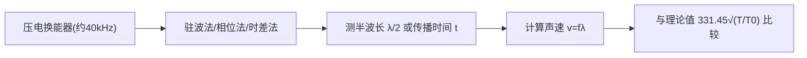

# 声速测量

## 实验目的

1. 了解声波和超声波的概念及特点。
2. 了解驻波的特点。
3. 理解换能器的工作原理。
4. 学会用相位法、驻波共振法等方法测量声速。

## 实验原理

声波是一种在弹性媒质中传播的纵波。声速是描述声波传播快慢的物理量，对声速的测量，尤其是对超声声速的测量，是声学技术的重要内容，在医学、测距、水下目标探测等方面均具有重要意义。

### 1. 相位法测声速

实验装置如图 25-1 所示。\(S_1\)、\(S_2\) 是两个压电陶瓷换能器，一个用于发射声波，一个用于接收声波。假定由 \(S_1\) 发出的超声波经过一段时间传播至 \(S_2\)，\(S_1\) 与 \(S_2\) 之间的距离为 \(L\)，则 \(S_1\) 和 \(S_2\) 处的声波相位差为：

\[
\varphi = \frac{2\pi L}{\lambda}
\]

若 \(L = n\lambda\)（\(n\) 为正整数），则 \(\varphi = 2n\pi\)。若能测量出相位差 \(\varphi\)，即可得到波长 \(\lambda\)，再利用频率计测量出波源的频率 \(f\)，则声速可计算得出：

\[
v = f \lambda
\]

!!! note "原理示意图：图25-1 相位法测声速的实验装置"
    页2, 相位法测声速实验装置示意图：含有机玻璃水槽、螺杆、数显尺杆、数显表头、皮管、鼓轮、液体进出通道、压电陶瓷换能器S1和S2

> **重点**：相位法的核心是利用两个换能器之间的距离 \(L\) 与波长 \(\lambda\) 的关系，通过测量相位差来求解波长，再结合频率计算声速。

### 2. 用李萨如图形测相位差

将输送至 \(S_1\) 的输入信号接入示波器 X 轴，\(S_2\) 接收到的信号接入示波器 Y 轴。设输入 X 轴的入射波的振动方程为：

\[
x = A_1 \cos(\omega t + \varphi_1)
\]

则 Y 轴接收到的 \(S_2\) 波形其振动方程为：

\[
y = A_2 \cos(\omega t + \varphi_2)
\]

合成振动方程为：

\[
\frac{x^2}{A_1^2} + \frac{y^2}{A_2^2} - \frac{2xy}{A_1 A_2} \cos(\varphi_2 - \varphi_1) = \sin^2(\varphi_2 - \varphi_1) \tag{25-1}
\]

该方程轨迹为椭圆，椭圆的长短轴和方位由相位差 \((\varphi_2 - \varphi_1)\) 决定：

- 若 \(\varphi = 0\)，则轨迹为图 25-2a 所示的直线；
- 若 \(\varphi = \pi/2\)，则轨迹为以坐标轴为主轴的椭圆，如图 25-2b 所示；
- 若 \(\varphi = \pi\)，则轨迹为如图 25-2c 所示的直线。

!!! note "原理示意图：图25-2 李萨如图形"
    页2-3, 李萨如图形随相位差变化：a为φ=0时的直线, b为φ=π/2时的椭圆, c为φ=π时的直线

由于 \(\varphi = \frac{2\pi L}{\lambda} = \frac{2\pi f L}{v}\)（\(f\) 为超声波的频率），若 \(S_2\) 离开 \(S_1\) 的距离为 \(L = \lambda/2\)，则 \(\varphi = \pi\)。随着 \(S_2\) 的移动，相位差在 \(0 \sim \pi\) 范围内变化，李萨如图形也随之如图 25-2 所示变化。相位差 \(\varphi\) 每变化 \(\pi\)，就会出现图 25-2a 的重复图形，因此通过图形的变化可测量出 \(\varphi\)，与这种图形重复变化相对应的 \(S_2\) 移动的距离为 \(\lambda/2\)。\(L\) 的长度由仪器上的标尺测量。

> **易错**：李萨如图形每重复出现一次相同图形（如直线斜率相同），\(S_2\) 移动的距离是 \(\lambda/2\)，而非 \(\lambda\)。注意区分同方向直线（\(\varphi = 0\) 和 \(\varphi = \pi\)）之间的距离为 \(\lambda/2\)，同方向直线重复出现（如两次 \(\varphi = 0\)）之间的距离为 \(\lambda\)。

### 3. 驻波共振法测声速

由发射器发出的声波近似于平面波。经接收器反射后，波将在两端面间来回反射并叠加，叠加的波可近似视为具有驻波加行波的特征。由纵波的性质可以证明，当接收器端面按振动位移而言处于波节时，则按声压而言处于波腹。

!!! note "原理示意图：图25-3 声压变化与接收器位置的关系"
    页3, 声压变化与接收器位置关系曲线图：显示接收器移动时声压的周期性变化，相邻波腹（或波节）间距为λ/2

当发生共振时，接收器端面近似为波节，声压最大，接收到的声压最大，经接收器转换成的电信号也最强。声压变化与接收器位置的关系可从实验中测量得出，当接收器端面移动到某个共振位置时，示波器上出现最强的电信号，若继续移动接收器，将再次出现较强的电信号，则两次共振位置之间的距离即为 \(\lambda/2\)（见图 25-3）。因此，只需测量出相邻两波腹（或波节）的位置 \(x_n\)、\(x_{n+1}\)，即可得到：

\[
\lambda = 2|x_{n+1} - x_n|
\]

> **重点**：驻波共振法中，接收器端面处于声压波腹（位移波节）时电信号最强，相邻两次最大电信号位置间距为 \(\lambda/2\)。

### 4. 时差法测声速

时差法测声速的基本原理为：

\[
v = \frac{L}{t} \tag{25-2}
\]

式中，\(v\) 为声速；\(L\) 为声音传播的距离；\(t\) 为声音传播的时间。通过在已知距离内测量声波传播的时间，从而计算出声波的传播速度。

### 5. 超声波的发射与接收——压电换能器

发射或接收超声的器件称为超声换能器。换能的含义是将一种形式的能量，如声、光、电、热等形式之一，转换为另一种形式。超声换能器所转换的对象显然是超声，某些种类的换能器既可产生超声，又可不加改变而接收超声，这类换能器称为可逆超声换能器。

压电换能器是目前最常用的可逆超声换能器。

本实验采用压电陶瓷超声换能器来实现声压和电压之间的转换，这类声速测量仪利用压电体的逆压电效应，即在信号发生器产生的交变电压作用下，使压电体产生机械振动而在空气中激发出声波。仪器采用锆钛酸铅（或钛酸钡）制成的压电陶瓷管，将其粘接在合金铝制成的阶梯形变幅杆上，并与信号发生器进行连接组成声波发生器，如图 25-4 所示。

!!! note "仪器/实物图：图25-4 压电换能器结构"
    页3-4, 压电换能器结构图：含压电陶瓷管、变幅杆、增强片、引线等部件

压电陶瓷处于交变电场中时，会发生周期性的伸长与缩短。当交变电场频率与压电陶瓷管的固有频率相同时，振幅最大。该振动又被传递给变幅杆，使其产生沿轴向的振动，于是变幅杆的端面在空气中激发出声波。实验中的压电陶瓷的谐振频率约为 \(40\,\text{kHz}\)，相应的超声波波长约为几毫米。其波长短，定向发射性能好。而变幅杆端面直径（为扩大直径另加一个环形薄片）比波长大很多，可近似认为在发射面远处的声波是平面波。

> **重点**：压电换能器利用逆压电效应工作——交变电场使压电陶瓷产生机械振动，当频率等于固有频率时振幅最大（共振）。谐振频率约为 \(40\,\text{kHz}\)。

### 6. 测量方法流程

## 实验仪器

- 示波器
- 综合声速测试仪（含信号源 SVX-5、压电陶瓷换能器 \(S_1\) 和 \(S_2\)、数显尺杆等）

## 实验步骤

### 步骤一：相位法测空气中声速

1. 按图 25-5 连接好线路。将测试方法设置为连续波方式，测量声波在空气中的速度。
2. 将信号源的发射信号与压电换能器接收的信号分别接入示波器的 X、Y 输入端。
3. 将信号输出频率调至压电陶瓷谐振频率 \(f_0\) 附近。
4. 将 \(S_2\) 靠拢 \(S_1\)，移动刻度鼓轮，使 \(S_2\) 缓慢离开 \(S_1\)。
5. 当示波器屏幕上出现图 25-2a 中斜线时，记录此时的位置 \(x_1\)。
6. 继续缓慢移动 \(S_2\)，记录示波器上曲线由图 25-2a 变为图 25-2c，再由图 25-2c 变为图 25-2a 时数显尺上的读数 \(x_2, x_3, \ldots, x_{12}\)，同时记录相应的频率 \(f\)。
7. 采用最小二乘法处理数据，求出超声波的波长。
8. 计算频率的平均值，由 \(v = f\lambda\) 式计算声速。
9. 记录室温 \(t\)，根据理论公式 \(v = v_0 \sqrt{T/T_0}\) 计算声速，其中 \(T_0\) 为 \(T_0 = 273.15\,\text{K}\) 时的声速，\(v_0 = 331.45\,\text{m/s}\)，\(T = t + 273.15\,\text{K}\)。
10. 最后计算测量值与理论值的百分误差。

!!! note "原理示意图：图25-5 实验线路连接图"
    页4, 实验线路连接示意图：SVX-5信号源、换能器S1和S2、示波器连接方式

### 步骤二：相位法测液体中声速

1. 将测试方法设置为连续波方式，测量声波在液体（水、油等）中的速度。
2. 了解液体中的换能器谐振频率 \(f_0\)，将信号输出频率调至 \(f_0\) 附近。
3. 采用相位法（或共振法）测量 1~3 组数据。
4. 通过最小二乘法等数据处理方法，得到声速，并与理论值（见表 25-1）进行比较。

### 步骤三：共振法测声速

1. 将测试方法设置为连续波方式，采用共振法测量声速。
2. 此时将信号接入示波器 \(Y_1\)、\(Y_2\) 输入端，可在示波器上观察到正弦波振幅的变化。
3. 移动至第一次振幅较大处，再仔细调节频率 \(f\)，使示波器上图形振幅达到最大。
4. 观察共振信号，记录共振时的频率 \(f\)。
5. 按原理中所述的方法进行波长测量，并采用最小二乘法计算速度，与理论值和相位法测量结果进行比较。

### 步骤四：时差法测声速

1. 将测试方法设置为脉冲波方式。
2. 将 \(S_1\) 和 \(S_2\) 之间的距离调整至一定距离（\(\geq 50\,\text{mm}\)）。
3. 再调节接收增益，使示波器上显示的接收波信号幅度在 \(300 \sim 400\,\text{mV}\)（峰-峰值），使定时器工作在最佳状态。
4. 记录此时的距离值和显示的时间值 \(L_i\)、\(t_i\)（时间由声速测试仪信号源时间显示窗口直接读出）。
5. 移动 \(S_2\)，同时调节接收增益使接收波信号幅度始终保持一致。
6. 记录此时的距离值和显示的时间值 \(L_{i+1}\)、\(t_{i+1}\)。

声速计算式为：

\[
v = \frac{L_i - L_{i-1}}{t_i - t_{i-1}}
\]

## 数据处理

### 1. 相位法数据处理

**测量方法**：通过李萨如图形判断相位差变化，每次图形重复（同方向直线）时记录 \(S_2\) 位置 \(x_i\) 和频率 \(f_i\)，共测量 12 个数据点。

**波长计算——最小二乘法**：

设第 \(i\) 次记录时 \(S_2\) 的位置为 \(x_i\)，由于每次图形重复对应 \(S_2\) 移动 \(\lambda/2\)，则：

\[
x_i = x_0 + \frac{\lambda}{2} \cdot i
\]

采用最小二乘法对 \((i, x_i)\) 进行线性拟合，斜率 \(k = \lambda/2\)，因此：

\[
\lambda = 2k
\]

**声速计算**：

\[
v = \bar{f} \cdot \lambda
\]

其中 \(\bar{f}\) 为频率的平均值。

**理论声速**：

\[
v_{\text{理}} = v_0 \sqrt{\frac{T}{T_0}} = 331.45 \sqrt{\frac{t + 273.15}{273.15}} \quad (\text{m/s})
\]

**百分误差**：

\[
E = \frac{|v_{\text{测}} - v_{\text{理}}|}{v_{\text{理}}} \times 100\%
\]

### 2. 驻波共振法数据处理

**测量方法**：移动接收器 \(S_2\)，记录每次示波器上电信号最大（声压波腹）时的位置 \(x_n\)。

**波长计算**：

\[
\lambda = 2|x_{n+1} - x_n|
\]

同样可采用最小二乘法对 \((n, x_n)\) 进行线性拟合，斜率 \(k = \lambda/2\)。

**声速计算**：\(v = f \lambda\)，与理论值和相位法结果进行比较。

### 3. 时差法数据处理

**测量方法**：在脉冲波方式下，测量不同距离 \(L_i\) 对应的传播时间 \(t_i\)。

**声速计算**：

\[
v = \frac{\Delta L}{\Delta t} = \frac{L_i - L_{i-1}}{t_i - t_{i-1}}
\]

也可采用最小二乘法对 \((t_i, L_i)\) 进行线性拟合，斜率即为声速 \(v\)。

### 4. 误差分析

> **易错**：误差来源主要包括以下几方面：

- **仪器误差**：数显尺的读数精度有限，频率计读数存在波动。
- **方法误差**：驻波共振法中判断“最大振幅”位置存在人为误差；相位法中判断李萨如图形为“直线”存在视觉误差。
- **环境误差**：温度波动影响声速理论值；空气湿度、气压对声速也有影响。
- **系统误差**：换能器非理想平面波源；反射波不完全；\(S_2\) 移动时可能存在机械间隙（空回误差）。

> **重点**：最小二乘法可以有效减小随机误差，利用多个数据点进行线性拟合比取相邻两点差值更为精确。

### 5. 纯液体中的声速参考值

**表 25-1 纯液体中的声速**

| 液体 | \(t\) (°C) | \(v\) (m/s) | \(\alpha\) (m/(s·K)) |
|:---:|:---:|:---:|:---:|
| 苯胺 | 20 | 1656 | -4.6 |
| 丙酮 | 20 | 1192 | -5.5 |
| 萘 | 20 | 1326 | -5.2 |
| 海水 | 17 | 1510~1550 | — |
| 普通水 | 25 | 1497 | 2.5 |
| 甘油 | 20 | 1923 | — |
| 煤油 | — | 1295 | — |
| 甲醇 | 20 | 1123 | 3.3 |
| 乙醇 | 20 | 1180 | -3.6 |

> \(\alpha\) 为温度系数，对于其他温度 \(t\) 的速度可按公式 \(v = v_0 + \alpha(t - t_0)\) 计算。

## 注意事项

1. 认真参阅教材，熟悉仪器使用，按信号源要求衰减后输出（使用功率输出，幅度调节器逆时针调节到头），以免烧坏换能器。

2. 注意按照实验步骤，先接线，后接通电源。

3. 仪器使用和调整需细心，轻按按钮，谨防损坏。

> **易错**：移动 \(S_2\) 时应缓慢单向旋转鼓轮，避免空回误差；若需反向移动，应退回一段距离后再同向逼近测量点。

> **重点**：换能器应在谐振频率附近工作，此时信号最强、信噪比最高，测量精度最佳。

## 思考题

### 预习思考题

1. **相位法如何测量声速？具体需测量哪些物理量？**

    ??? note "参考答案"
        相位法利用两个换能器之间的声波相位差与距离的关系测量声速。将发射信号接入示波器 X 轴、接收信号接入 Y 轴，形成李萨如图形。具体测量的物理量包括：换能器间距 \(L\)（由数显尺读出）、信号频率 \(f\)（由频率计读出）。当李萨如图形重复出现相同形态时，\(S_2\) 移动的距离为 \(\lambda/2\)，由此求出波长 \(\lambda\)，再由 \(v = f\lambda\) 计算声速。

2. **实验中为何采用超声波而非次声波或可闻声波来测量声速？**

    ??? note "参考答案"
        - 超声波波长短（约几毫米），定向发射性能好，可近似视为平面波，测量精度高。
        - 超声波频率高（约 \(40\,\text{kHz}\)），超出人耳听觉范围，不会造成噪声干扰。
        - 次声波波长太长，需要极大的测量空间，实际不可行。
        - 可闻声波易受环境噪声干扰，且波长较长导致测量精度较差。

### 思考题

1. **如何判断压电陶瓷处于共振状态？**

    ??? note "参考答案"
        当信号源的频率调至压电陶瓷的谐振频率时，压电陶瓷振幅最大，接收换能器 \(S_2\) 输出的电信号最强。具体判断方法：在示波器上观察接收信号的振幅，缓慢调节信号频率，当振幅达到最大时即为共振状态。在驻波共振法中，共振时示波器上正弦波振幅最大；在相位法中，共振时李萨如图形清晰稳定且幅度最大。

2. **为何换能器需在谐振频率条件下进行声速测定？**

    ??? note "参考答案"
        - 谐振频率下换能器的电声转换效率最高，发射和接收的信号最强，信噪比高。
        - 信号强使得示波器上图形清晰，便于判断相位差变化和共振位置，提高测量精度。
        - 偏离谐振频率时信号微弱，噪声相对增大，测量误差显著增加。

3. **分析实验结果误差的产生原因。**

    ??? note "参考答案"
        - **读数误差**：数显尺读数存在最小分度限制；判断李萨如图形为直线或振幅最大时存在人为视觉误差。
        - **频率误差**：信号源频率稳定性有限，频率读数存在波动。
        - **温度误差**：实验过程中温度可能变化，影响理论声速值；温度计读数本身也存在误差。
        - **机械误差**：鼓轮移动存在空回误差；\(S_2\) 移动时导轨可能不严格平行。
        - **方法近似误差**：声波非理想平面波；反射波不完全；驻波条件为近似条件。
        - **环境误差**：空气湿度、气压对声速有影响，理论公式仅考虑了温度因素。