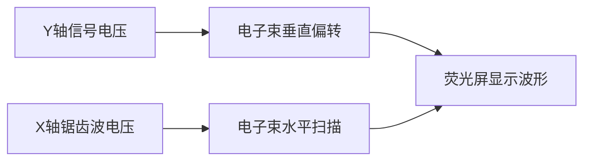

# 示波器的使用

> **说明**：本笔记整理自《大学物理实验（第3版）》"实验9 示波器的使用"。PDF共8页（扫描图片版），其中第1页上部为实验8（电子束偏转与聚焦）的结尾，第8页下部为实验10（电位差计）的开头，示波器实验内容分布于第1页下部至第8页上部。PDF实际内容与文件名一致，确认为示波器实验。

## 实验目的

1. 掌握模拟示波器的主要结构和基本工作原理。
2. 熟悉信号发生器的基本功能和使用方法。
3. 熟悉示波器的基本调节方法，能使用示波器测量输入信号幅度、频率、相位差等参量。
4. 了解示波器在电路参量以及非电学量测量中的应用。

## 实验原理

### 1. 示波器的基本功能

用示波器可以直接观察电压波形，并测定电压的大小。因此，一切可转化为电压的电学量（如电流、电功率、阻抗等）、非电学量（如温度、位移、速度、压力、光强、磁场、频率等）以及它们随时间的变化过程都可用示波器来观测。

> **重点**：示波器本质上是一台"电压-图形"转换仪器，任何能转化为电压的物理量均可通过示波器观测其随时间的变化。

### 2. 数字示波器与模拟示波器

目前应用广泛的示波器是数字示波器，通过模数转换器（ADC）采样信号，经数字信号处理后在屏幕上显示波形，因此在精度、分辨率、自动测量和数据分析方面具有优势。模拟示波器通过电子束直接在荧光屏上显示连续的模拟信号波形，在观察慢速变化或连续波形时更为直观，且更具有物理内涵。本实验采用模拟示波器。模拟示波器和数字示波器在使用上有很多相通之处。

### 3. 模拟示波器的基本组成

模拟示波器有各种不同的型号，但基本上所有的模拟示波器都由**示波管**、**锯齿波发生器**、**Y轴电压放大器**和**X轴电压放大器**（包括衰减器）组成，如图9-1所示。示波管的构造和工作原理在实验8中已经详细介绍过，这里不再赘述。

!!! note "原理示意图：图9-1 示波器的原理方框图"
    页2, 示波器原理方框图

### 4. X轴、Y轴电压放大器和衰减器

由于示波管本身的X轴及Y轴偏转板的灵敏度不高（约 \(0.1 \sim 1 \text{ mm/V}\)），当加于偏转板的信号电压较小时，电子束不能发生足够的偏转，以致屏上光点位移过小，不便观测。这就需要预先把小的信号电压加以放大再加到偏转板上。为此，设置X轴和Y轴电压放大器（也称增幅器）。

从"Y轴输入"与"地"两端接入的输入电压，经"衰减器"（即分压器）衰减后，作用于"Y轴电压放大器"，再经增幅器放大后作用于 \(Y_1\)-\(Y_2\) 两偏转板，能使示波管屏上光点位移范围增大。调节"Y轴增幅"旋钮，即调整放大倍数，可连续地改变屏上光点位移的大小。

"衰减器"的作用是使过大输入的电压变小，以适应"Y轴放大器"的要求，否则放大器不能正常工作，甚至受损。X轴上的衰减器与电压放大器具有同样的作用。

> **易错**：衰减器（V/div旋钮）不是"放大"，而是"缩小"过大的输入信号。测量时应先置于大衰减挡（小灵敏度），再逐步减小衰减，避免信号过载。

### 5. 锯齿波发生器（扫描）

锯齿波发生器产生锯齿波电压。在X轴偏转板加上随时间成正比线性增大、然后又突然下降的周期性电压，这时电子束在荧光屏上的亮点由左匀速地向右运动，到右端后马上回到左端，不断重复上述过程。当重复的频率较大时，由于荧光材料具有一定的余辉时间，在荧光屏上看到的是一条水平线，如图9-2所示。

!!! note "原理示意图：图9-2 锯齿波波形"
    页2, 锯齿波电压波形

在示波管的偏转板上加上不同的直流电压，可以控制电子束的偏转方向，从而改变荧光屏上亮点的位置。如果在Y轴偏转板上加一交变的正弦电压，则荧光屏上的亮点在垂直方向做上下来回运动，看到的是一条垂直的亮线，如图9-3所示。

!!! note "原理示意图：图9-3 纵向电压图"
    页2-3, Y轴加正弦电压显示垂直亮线

### 6. 正弦波形显示原理

如果在Y轴偏转板上加一交变的正弦电压的同时，又在X轴偏转板上加一锯齿波电压，则荧光屏上的光点将同时参与互相垂直的两种位移，我们观察到的将是光点的合成位移，即正弦波形图。其合成原理如图9-4所示。

!!! note "原理示意图：图9-4 正弦波形显示原理图"
    页3, 正弦波合成显示原理

当 \(t=0\) 时，Y轴和X轴偏转板上的电压都等于零，荧光屏上的光点在零点；当 \(t=1\) 时，Y轴和X轴偏转板上都加有电压，Y轴偏转板的上板为正，X轴偏转板的右板为正，荧光屏上的光点向右上方移动，光点在荧光屏上的位置为"1"，以下以此类推。随着Y轴电压的变化，亮点上下移动，因X轴所加电压随时间增加而增大，荧光屏上就形成了与Y轴偏转板上外加电压相同的波形。当光点到达"12"点时，Y轴电压变化一周，X轴电压立刻回到零，光点也回到零点。第二个周期又进行同样的移动。

> **重点**：波形显示的本质是X轴"时间扫描"与Y轴"信号电压"的合成。X轴锯齿波把时间转化为水平位移，Y轴信号电压转化为垂直位移。

### 7. 同步与扫描

从图9-4看出，只有X、Y轴偏转板上电压周期严格地相同，荧光屏上才可显示出一个稳定的波形，这种关系称为**同步**。使光点在X轴上移动的作用称为**扫描**。

如果正弦波电压和锯齿波电压的周期稍有不同，则第二次所扫出的曲线将和第一次的曲线位置稍微错开，在荧光屏上将看见不稳定的图形或不断移动的图形，甚至很复杂的图形，因而无法进行观察。

若 \(U_x\) 的周期 \(T_x\) 是 \(U_y\) 周期 \(T_y\) 的整倍数：

\[
T_x = n \, T_y \quad (n = 1, 2, 3, \cdots) \tag{9-1}
\]

则在屏上显示一个或几个完整的 \(U_y\) 的波形，如图9-5所示。

!!! note "原理示意图：图9-5 输入电压图"
    页3, 稳定波形显示

### 8. 李萨如图形

如果X轴和Y轴偏转板同时加上正弦电压，光点的运动是两个相互垂直的简谐振动的合成。X轴方向振动的频率 \(f_x\) 与Y轴方向振动的频率 \(f_y\) 的比值为简单整数时，光点合成运动的轨迹是一个封闭的图形，这时荧光屏上就显示**李萨如图形**，如表9-1所示。

!!! note "原理示意图：表9-1 李萨如图形"
    页4, 不同频率比的李萨如图形表

李萨如图形可用来测量未知频率。设 \(f_y\)、\(f_x\) 分别代表Y轴和X轴偏转板上电压的频率，\(N_y\) 代表Y方向的切线（垂直切线）和图形相切的切点数，\(N_x\) 代表X方向的切线（水平切线）和图形相切的切点数，则有：

\[
\frac{f_y}{f_x} = \frac{N_x}{N_y} \tag{9-2}
\]

> **重点**：李萨如图形测频率的关键是正确数出切点数。水平切线切点数 \(N_x\) 对应Y方向频率 \(f_y\)，垂直切线切点数 \(N_y\) 对应X方向频率 \(f_x\)。

### 补充说明1：同步原理

被测信号频率 \(f_y\) 不可能刚好是扫描频率 \(f_x\) 的整数倍。虽然可通过调节扫描频率 \(f_x\) 使其满足整数倍的关系，但由于扫描信号源与被测信号源是独立的，不可能始终满足这一条件。为此示波器必须具有扫描同步功能。常用的示波器同步扫描具有两种方式：**连续扫描**和**触发扫描**。

**锯齿波发生器原理**：扫描信号由锯齿波发生器产生，其方框图如图9-8所示，它由恒流源（电压为 \(U_d\)）、电子开关S、电容C、比较器、参考电压源 \(U_r\) 组成。电子开关由比较器输出状态控制。当电容两端电压 \(U_c < U_r\) 时，比较器输出状态使开关置于1，恒流源开始向电容C充电，电容起到积分器的作用，其所充电荷与时间成正比，相应的电压也与时间成正比。电容两端电压达到并大于 \(U_r\) 时，比较器输出状态反转，控制开关置于2的位置，电容迅速放电，使其电压达到 \(U_0\)。这时 \(U_c < U_r\)，比较器状态又反转，置开关于1，恒流源又向电容充电，如此不断循环产生锯齿波。把电容两端电压放大即可提供扫描信号。

!!! note "原理示意图：图9-8 锯齿波发生器方框图"
    页5, 锯齿波发生器原理方框图

如果在参考电压端除加上 \(U_r\) 外，再加上同步信号（与被测信号频率有确定关系），这样参考信号为二者叠加，如图9-9所示。根据锯齿波发生原理，当同步信号频率接近扫描信号频率时，同步信号的存在将使比较器状态变化提前或推迟，即电容提前或推迟放电，使扫描信号频率与锯齿波信号频率始终保持整数倍关系。同步信号幅度选取要适当，过大了会引起扫描信号失真（即产生一个小的锯齿波），从而使显示出的被测信号失真，如图9-10所示。

!!! note "原理示意图：图9-9 比较器输出电压图"
    页5, 同步信号叠加后的比较器输出

!!! note "原理示意图：图9-10 比较器输出电压图（同步信号过大）"
    页5, 同步信号过大导致失真

另一个较常用的扫描方式是**触发扫描**。在这种方式中，把被测信号或与之有关的信号整形变成触发脉冲信号，扫描信号发生器在触发脉冲触发下产生一个扫描信号（在扫描过程中，扫描电路不受在此期间的触发脉冲的影响）。完成一次扫描后，等待下一个触发脉冲，再进行一次扫描。这样产生的扫描信号必定保证了完全稳定的条件。其原理方框图与波形如图9-11所示。

!!! note "原理示意图：图9-11 扫描信号波形"
    页6, 触发扫描信号波形

### 补充说明2：示波器的双踪显示和触发扫描

#### （1）双踪显示

为对比、分析、研究诸如激励和响应或同一激励下不同响应的瞬变过程，需要将不同的信号电压同时在一个屏幕上显示出来，这就是多踪示波器。图9-12为双踪示波器的原理框图。通过对电子开关工作状态的设定控制，可以实现双踪显示。CH1和CH2两个通道的信号以不同方式进行显示。

!!! note "原理示意图：图9-12 双踪示波器原理框图"
    页6, 双踪示波器原理框图

- **"交替"方式**：电子开关的转换动作受机内扫描信号控制。在第m次扫描期，电子开关接通CH1通道，屏上显示CH1通道送入的信号波形；接着电子开关接通CH2通道，进行第m+1次扫描，显示CH2通道送入的信号波形；接着再接通CH1通道……这样便轮流对CH1和CH2两个通道送入的信号进行扫描、显示。当开关转换的交替频率（扫描频率的一半）足够高时，借助荧光屏的余辉作用和人的视觉暂留特性，使用者便能在荧光屏上同时观察到两个清晰的波形。这种方式适合于观测频率较高的输入信号电压。

!!! note "原理示意图：图9-13 双踪显示扫描过程"
    页6, 交替方式双踪显示扫描过程

- **"断续"方式**：电子开关不再受扫描信号的控制，而是处于自激振荡状态。在一个扫描周期内，电子开关以相同的时间间隔，时而把CH1通道接通，时而把CH2通道接通，经过若干次这样的断续转换完成了X方向扫描，CH1和CH2两个通道的信号就以打点的方式同时显示在屏上。由于振荡频率很高，屏上光点靠得很近，利用消隐技术使过渡线和回扫线不显示，同样可以同时清晰地显示两个波形。这种方式适合于输入信号频率较低的场合。

!!! note "原理示意图：图9-14 断续显示扫描过程"
    页7, 断续方式双踪显示扫描过程

> **重点**："交替"适合高频信号，"断续"适合低频信号。选择不当会导致波形闪烁或显示不完整。

#### （2）触发扫描

示波器显示波形时，X方向为时间轴线（时基线），它是在锯齿波电压的驱动下实现的。若锯齿波发生器工作在自激振荡状态，其输出的连续扫描波与待测信号波形必须满足 \(T_x = nT_y\) 的整步条件，才能在屏幕上看到稳定的波形。然而这样的扫描方式会给某些输入信号波形的观测带来困难。

例如对图9-15a所示的待观测信号，即使整步条件中 \(n=1\)（见图9-15b），在荧光屏上也只能看到一条很窄的垂直线（见图9-15e），而 \(\tau\) 这段时间内的波形图根本无法分辨。若采用"触发扫描"方式建立时基，如图9-15c或图9-15d所示，它是一种断续的锯齿波。由图可见，虽然触发扫描也是周期性的，但对观测信号的同一周期所取的扫描速度（习惯用其倒数 t/div 标注）却可以不同，从而对应显示出的图形也就不同，如图9-15f、g所示。

!!! note "原理示意图：图9-15 不同扫描方式下的波形显示"
    页7-8, 连续扫描与触发扫描对比

采用触发扫描时，锯齿波发生器工作在它激状态，它仅在扫描闸门信号的作用下才开始扫描，否则不扫描。由于闸门信号是受具有释抑特性的触发器控制操纵的，可保证每次触发扫描的起始时刻都是在待测信号的同一相位上，即每次扫描所显示的图线完全重合，从而使屏幕上的图线得到稳定显示。这样，选取不同的扫速和触发信号的极性及电平（触发增幅）就能在屏幕上显示出想要观测的那一部分波形。

但采用触发扫描后，不扫描的时间比例可能很大，为了不使屏幕被这一特别亮的光点烧坏，常采用**增辉技术**去控制电子枪，即示波管在不扫描和回扫时不发射电子，使这段时间内屏上无光迹，只有在扫描正程期间才发射电子，达到保护屏幕的目的。但这一做法在操作不当时（如位移电压调节不当、Y轴主放大器输出过大或过小、触发电平调得不当等），会使屏幕上看不到光迹显示，这时通常把扫描方式转换成"自激扫描"状态就可方便地寻找光迹。

### 9. 波形显示原理流程图

> **重点**：波形显示的本质是X轴"时间扫描"与Y轴"信号电压"的合成。X轴锯齿波把时间转化为水平位移，Y轴信号电压转化为垂直位移，二者叠加即在荧光屏上得到被测信号的稳定波形。同步条件 \(T_x = nT_y\) 是波形稳定显示的关键。

## 实验仪器

- 信号源（信号发生器）
- 示波器（模拟示波器）

> **重点**：信号发生器提供已知频率和幅度的正弦波信号，作为示波器的输入信号源。示波器用于观察波形并测量电压、频率、相位差等参量。

## 实验步骤

### 1. 熟悉示波器并校准

1. 熟悉示波器面板上各旋钮和按键的功能和用法。
2. 学习示波器的校准方法（使用示波器自带的校准信号进行校准）。
3. 观察不同类型周期性输入电压信号，通过触发同步操作，得到稳定的波形。

### 2. 测量信号的幅度和频率

1. 将输入选择开关放在"AC"位置，使被测信号的直流分量隔开。
2. 从Y轴输入正弦信号，在荧光屏上显示稳定的正弦波形。
3. 直接读出Y轴偏转的格数（峰-峰之间的垂直距离）。
4. 根据输入偏转因数"V/div"旋钮所指的位置读数，每格偏转电压值乘以峰-峰之间的Y轴偏转距离，即为峰-峰值电压。
5. 测量信号周期：读出一个完整周期在X轴上对应的格数，乘以"time/div"（扫描时间因数）旋钮的读数，得到周期 \(T\)，再由 \(f = 1/T\) 计算频率。

> **易错**：测量电压时，V/div旋钮的微调旋钮必须处于"校准"（CAL）位置，否则读数不准确。测量时间（周期）同理，time/div的微调也须处于校准位置。

### 3. 用李萨如图形测量未知频率

1. 将被测频率信号输入仪器"Y2"端，将已知频率信号输入仪器"Y1"输入端。
2. 示波器置于X-Y方式（将Y1作为X轴输入，Y2作为Y轴输入）。
3. 调节示波器和被测频率信号，取 \(f_y : f_x\) 分别为 \(1:1\)、\(1:2\)、\(1:3\) 和 \(2:3\) 等关系。
4. 使输入的两个正弦波合成李萨如图形，画下稳定的李萨如图形。
5. 数出水平切线切点数 \(N_x\) 和垂直切线切点数 \(N_y\)。
6. 根据式 (9-2) 利用已知频率计算未知频率。
7. 与信号源指示的频率相比较，计算相对误差。

## 数据处理

### 1. 电压测量

**测量方法**：利用示波器的偏转因数"V/div"旋钮读取电压。

**公式推导**：设"V/div"旋钮指示值为 \(k\)（单位：V/div），峰-峰之间Y轴偏转格数为 \(\Delta Y\)（单位：div），则峰-峰值电压为：

\[
U_{pp} = k \times \Delta Y
\]

有效值电压（对正弦波）为：

\[
U_{rms} = \frac{U_{pp}}{2\sqrt{2}}
\]

### 2. 频率测量

**方法一：直接测周期法**

设"time/div"旋钮指示值为 \(s\)（单位：s/div 或 ms/div），一个完整周期对应X轴偏转格数为 \(\Delta X\)（单位：div），则信号周期为：

\[
T = s \times \Delta X
\]

频率为：

\[
f = \frac{1}{T} = \frac{1}{s \times \Delta X}
\]

**方法二：李萨如图形法**

根据式 (9-2)，已知 \(f_x\)，数出 \(N_x\) 和 \(N_y\)，则：

\[
f_y = f_x \times \frac{N_x}{N_y}
\]

### 3. 相位差测量

利用李萨如图形（椭圆法）测量两个同频率正弦信号的相位差。设椭圆与Y轴（垂直方向）的截距为 \(2b\)，椭圆在Y方向的最大幅度为 \(2B\)，则相位差为：

\[
\varphi = \arcsin\!\left(\frac{b}{B}\right)
\]

或设椭圆与X轴的截距为 \(2a\)，椭圆在X方向的最大幅度为 \(2A\)，则：

\[
\varphi = \arcsin\!\left(\frac{a}{A}\right)
\]

> **重点**：相位差测量时，椭圆的形状取决于两信号的相位差。当 \(\varphi = 0\) 或 \(\pi\) 时，椭圆退化为斜直线；当 \(\varphi = \pi/2\) 时，椭圆为正圆（两信号幅度相同时）。

### 4. 误差分析

1. **格数读数误差**：人眼读取格数存在估读误差，通常为 \(\pm 0.1\) div。对电压测量，相对误差为：

\[
\frac{\Delta U_{pp}}{U_{pp}} = \sqrt{\left(\frac{\Delta k}{k}\right)^2 + \left(\frac{\Delta(\Delta Y)}{\Delta Y}\right)^2}
\]

2. **V/div 和 time/div 校准误差**：若微调旋钮未处于校准位置，会引入系统误差。

3. **李萨如图形稳定性误差**：图形不完全稳定时，切点数判断可能不准确，尤其当图形较复杂时。

4. **信号源频率指示误差**：信号发生器自身频率指示存在误差，作为"已知频率"会传递到测量结果中。

5. **同步误差**：若扫描与信号未完全同步，波形移动会导致读数偏差。

> **易错**：李萨如图形法测频率时，若图形不稳定（缓慢翻转），说明两信号频率比未严格满足简单整数比，应微调信号频率使图形完全稳定后再读数。

## 注意事项

1. **光点亮度**：光点不能太亮，且不应长时间停留在同一点，以免烧坏荧光屏。暂时不观察时应将亮度调低。
2. **开机前检查**：实验通电前，检查各旋钮初始位置，亮度旋钮调至最小，避免开机后光点过亮。
3. **输入电压限制**：输入信号电压不能超过示波器允许的最大输入电压，否则可能损坏输入放大器。应先将V/div置于大衰减挡（低灵敏度），再逐步减小衰减。
4. **校准状态**：测量前应确认V/div和time/div的微调旋钮均处于"校准"（CAL）位置。
5. **AC/DC耦合选择**：测量交流信号时使用AC耦合，测量直流分量或低频信号时使用DC耦合。
6. **李萨如图形测量**：应调节到图形完全稳定后再读数和画图。切换X-Y方式前，应先将不必要的旋钮复位。
7. **读数视差**：读数时视线应垂直于屏幕，减小视差。利用屏幕刻度线（光标法）可提高读数精度。
8. **使用完毕**：实验结束后，先将亮度调至最小，再关闭电源。
9. **接地与共地**：信号发生器与示波器的"地"（GND）端应可靠连接（共地），避免因接地不良引入干扰或使波形畸变；测量时地线夹应先接好再接信号探头。
10. **触发设置**：波形不稳定时，优先检查触发源（Source）是否选对信号所在通道、触发耦合方式是否合适、触发电平（Level）是否落在信号幅值范围内，再考虑微调扫描速度。
11. **探头衰减比匹配**：若使用带衰减的探头（如 10:1），须将示波器通道的探头系数设为对应档位，否则电压读数会差 10 倍。

> **重点**：保护荧光屏是示波器使用中最重要的事项之一。光点过亮或长时间停留同一点会灼伤荧光物质，造成永久性损伤。

## 思考题

### 预习思考题

**（1）示波器显示稳定波形的条件是什么？简略说明在电路上如何实现？**

??? note "参考答案"
    显示稳定波形的条件是扫描电压（锯齿波）的周期 \(T_x\) 等于被测信号周期 \(T_y\) 的整数倍，即 \(T_x = nT_y\)（\(n\) 为正整数）。在电路上，通过"同步"功能实现：将被测信号（或与之相关的信号）作为同步信号作用于锯齿波发生器的参考电压端，使扫描频率自动跟踪被测信号频率，始终保持整数倍关系。也可采用触发扫描方式，由被测信号整形为触发脉冲来触发每次扫描，保证每次扫描起始相位相同。

    - **连续扫描（整步）**：同步信号叠加在参考电压上，使锯齿波频率被"牵引"到整数倍关系；
    - **触发扫描**：被测信号整形为触发脉冲，每次触发才开始一次扫描，等待下次触发，从根本上保证每次扫描起点相位一致。

**（2）如果 \(T_x\) 略小于 \(T_y\)，观察到的波形向左还是向右移动？**

??? note "参考答案"
    当 \(T_x\) 略小于 \(T_y\)（扫描周期略短于信号周期，即扫描偏快）时，每次扫描结束时信号尚未完成一个完整周期，下一次扫描的起始相位比上一次略有提前（等效相位减小），波形表现为**向右移动**。反之，若 \(T_x\) 略大于 \(T_y\)，波形向左移动。

    **判别口诀**：扫描偏快（\(T_x<T_y\)）波形向右跑，扫描偏慢（\(T_x>T_y\)）波形向左跑。其本质是每次扫描起点对应的信号相位在递增（偏快时相位滞后），使波形特征点在屏幕上逐次右移。

### 思考题

**（1）结合示波器面板的各旋钮，总结一下在荧光屏上显示稳定的正弦波和李萨如图形应如何调节？**

??? note "参考答案"
    - **显示稳定正弦波**：① 将信号接入Y轴输入，输入耦合置AC；② 调节V/div使波形幅度适中（约占屏幕1/2~2/3）；③ 调节time/div（扫描速度）使屏幕显示2~3个完整周期；④ 调节触发电平（Level）旋钮使波形稳定（触发指示灯亮）；⑤ 若波形仍不稳定，检查触发源是否选择正确（应选Y轴通道）、触发耦合方式是否合适。
    - **显示李萨如图形**：① 将已知频率信号接入Y1（X轴），被测信号接入Y2（Y轴）；② 按下X-Y按钮，切换到X-Y工作模式；③ 调节两通道的V/div使图形大小适中；④ 微调已知信号频率，使图形稳定（频率比为简单整数比时图形封闭稳定）；⑤ 数出切点数计算频率。

**（2）根据 \(U_x\) 与 \(U_y\) 波形，画出合成后的波形图，如图9-6、图9-7所示。**

!!! note "原理示意图：图9-6 X、Y轴输入电压波形(1)"
    页5, 思考题波形合成图(1)

!!! note "原理示意图：图9-7 X、Y轴输入电压波形(2)"
    页5, 思考题波形合成图(2)

??? note "参考答案"
    根据给定的 \(U_x\)（锯齿波或正弦波）和 \(U_y\)（正弦波）波形，按照波形合成原理（图9-4所示方法），在对应时刻将X方向位移和Y方向位移合成，逐点描绘即可得到荧光屏上显示的波形。具体作图方法：在 \(U_x\)-\(t\) 和 \(U_y\)-\(t\) 图上取若干等分时刻，将各时刻的 \(U_x\) 值作为水平坐标、\(U_y\) 值作为垂直坐标，在合成图上描点连线。

    - 当 \(U_x\) 为锯齿波时，合成得到与 \(U_y\) 相似的波形（线性时间扫描）；
    - 当 \(U_x\) 也为正弦波时，合成得到李萨如图形，其形状取决于两信号频率比与相位差。
