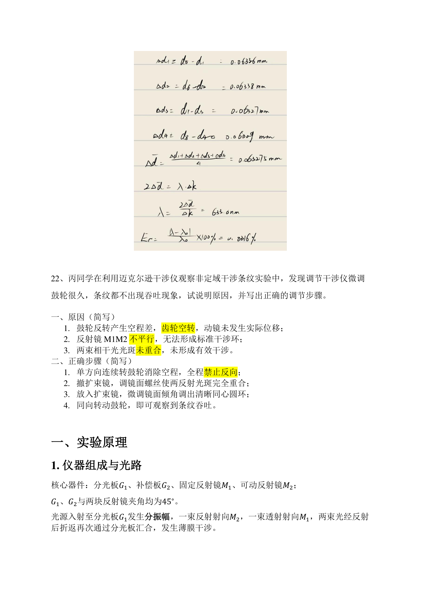
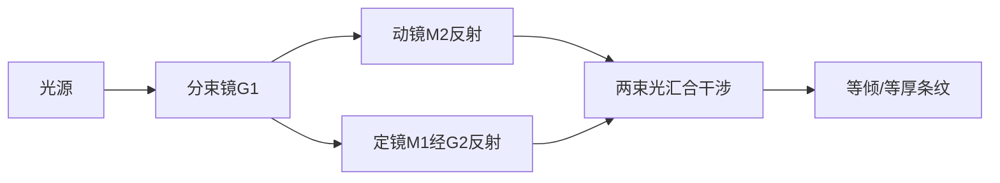
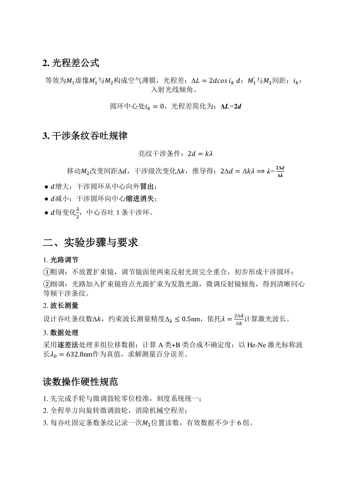
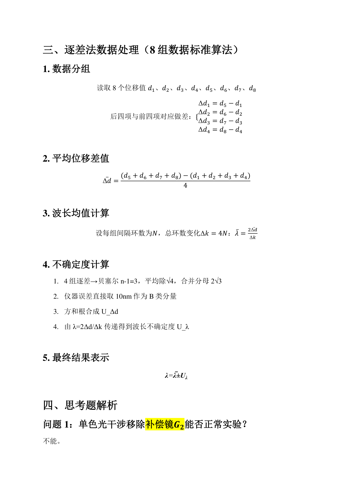

# 迈克尔逊干涉仪

> **说明**：本笔记基于扫描版 PDF《实验10 迈克尔逊干涉仪实验（分振幅干涉）》整理。经逐页视觉阅读与文本提取确认，PDF 实际内容确为迈克尔逊干涉仪实验，文件名与内容一致。该资料包含选择题、填空题、计算题、简答题及实验原理总结，本笔记按七段式结构重新组织，兼顾学习与复习用途。

---

## 实验目的

1. 了解迈克尔逊干涉仪的结构、原理与分振幅干涉机制。
2. 掌握迈克尔逊干涉仪的调节方法，观察非定域等倾干涉条纹。
3. 利用干涉条纹吞吐规律测量 He-Ne 激光波长。
4. 掌握逐差法数据处理方法及不确定度评定。

---

## 实验原理

### 1. 仪器组成与光路

迈克尔逊干涉仪的核心器件包括：

- **分光板 \(G_1\)**：背面镀半透半反膜，将入射光分为振幅近似相等的两束。
- **补偿板 \(G_2\)**：与 \(G_1\) 平行、等厚同材，补偿透射光多出的玻璃光程。
- **固定反射镜 \(M_1\)**：位置固定的反射镜。
- **可动反射镜 \(M_2\)**：可通过鼓轮沿导轨平移的反射镜。

\(G_1\)、\(G_2\) 与两块反射镜夹角均为 \(45^\circ\)。光源入射至分光板 \(G_1\) 发生分振幅：一束反射光射向 \(M_2\)，一束透射光经 \(G_2\) 射向 \(M_1\)；两束光经反射后折返，再次通过 \(G_1\) 汇合，发生薄膜干涉。

!!! note "仪器/实物图：迈克尔逊干涉仪光路图"
    页3, 仪器光路实物图

> **重点**：\(M_1\) 经 \(G_1\) 成虚像 \(M_1'\)，等效为 \(M_1'\) 与 \(M_2\) 构成的空气薄膜干涉。

### 2. 光程差公式

等效空气薄膜厚度为 \(d\)（即 \(M_1'\) 与 \(M_2\) 间距），入射光线倾角为 \(i_k\)，光程差为：

\[
\Delta L = 2d\cos i_k
\]

圆环中心处 \(i_k = 0\)，光程差简化为：

\[
\Delta L = 2d
\]

### 3. 干涉条纹吞吐规律

亮纹干涉条件：

\[
2d = k\lambda
\]

移动 \(M_2\) 改变间距 \(\Delta d\)，干涉级次变化 \(\Delta k\)，推导得位移-条纹关系：

\[
2\Delta d = \Delta k \,\lambda \quad \Longrightarrow \quad \lambda = \frac{2\Delta d}{\Delta k}
\]

条纹变化规律：

| 间距变化 | 条纹现象 |
|---------|---------|
| \(d\) 增大 | 干涉圆环从中心向外**冒出** |
| \(d\) 减小 | 干涉圆环向中心**缩进**消失 |
| \(d\) 每变化 \(\lambda/2\) | 中心吞吐 **1** 条干涉环 |

> **重点**：\(\Delta d = N\lambda/2\)，即动镜每移动 \(\lambda/2\)，吞吐 1 条条纹。这是波长测量的核心依据。

### 4. 非定域干涉条纹特点

单色点光源经迈克尔逊干涉仪产生**非定域干涉**——两束相干光在整个空间任意位置都能发生干涉，干涉条纹没有固定局限区域。其条纹特点：

1. 条纹为**同心圆环**，圆心随视线偏移；
2. **里疏外密**（越靠中心条纹间距越大，越靠边缘越密）；
3. 空间任意位置均可观察到干涉图样（非定域）。

### 5. 核心公式清单

| 公式名称 | 数学表达式 |
|---------|-----------|
| 等倾干涉通用光程差 | \(\Delta L = 2d\cos i_k\) |
| 中心处光程差 | \(\Delta L = 2d\) |
| 亮纹级次条件 | \(2d = k\lambda\) |
| 位移-条纹变化关系 | \(2\Delta d = \Delta k\,\lambda\) |
| 波长测量核心式 | \(\lambda = \dfrac{2\Delta d}{\Delta k}\) |
| 八数据逐差平均位移 | \(\overline{\Delta d} = \dfrac{\sum_{\text{后4项}} d - \sum_{\text{前4项}} d}{4}\) |
| 实验结果标准范式 | \(\lambda = \overline{\lambda} \pm U_\lambda\) |

### 6. 光路原理流程图

> **重点**：分束镜 \(G_1\) 将入射光"分振幅"为两束，分别经 \(M_1\)、\(M_2\) 反射后再次汇合发生干涉。\(M_1\) 经 \(G_1\) 成虚像 \(M_1'\)，等效为 \(M_1'\) 与 \(M_2\) 之间的空气薄膜干涉。动镜每移动 \(\lambda/2\)，中心吞吐一条条纹，这是测波长的核心依据。

---

## 实验仪器

1. **迈克尔逊干涉仪**：含分光板 \(G_1\)、补偿板 \(G_2\)、固定反射镜 \(M_1\)、可动反射镜 \(M_2\)、粗调手轮、微调鼓轮。
2. **He-Ne 激光器**：标称波长 \(\lambda_0 = 632.8\,\text{nm}\)。
3. **扩束镜**：将激光点光源扩束为发散光源。
4. **接收屏**：观察干涉条纹。

### 读数系统（三部分）

| 组成 | 标记 | 精度 | 说明 |
|------|------|------|------|
| 左侧直尺 | \(C_1\) | \(1\,\text{mm}\) | 粗读位移 |
| 正面上方读数窗 | \(C_2\) | \(0.01\,\text{mm}\) | 中等精度 |
| 右侧微动转轮标尺 | \(C_3\) | \(0.01\,\text{mm}\) | 微调位移，**最后估读一位** |

> **重点**：干涉仪的估读精度为 \(50\,\text{nm}\) 水平。为实现 nm 量级精度的测量，实验采用了**光程差放大方法**（通过计数大量条纹将微小位移放大）和**逐差法**数据处理方法。

---

## 实验步骤

### 1. 光路调节

**① 粗调**：不放置扩束镜，调节镜面螺丝使两束反射光斑在接收屏上**完全重合**，初步形成干涉条件。

**② 细调**：光路加入扩束镜，将点光源扩束为发散光源；微调反射镜倾角，得到清晰的**同心圆环**等倾干涉条纹。

> **易错**：必须先调好无扩束镜时的光斑重合，再加扩束镜，防止光路彻底失调。

### 2. 波长测量

1. 调节仪器使接收屏上干涉条纹呈同心圆环形状。
2. 记下初始位置 \(d_0\)。
3. **同方向**旋转微调小鼓轮，条纹出现冒出/吞入现象。
4. 当条纹变化 \(N = 50\) 环时，记下当前位置 \(d_i\)。
5. 重复上述操作，获取有效数据**不少于 6 组**（本实验取 8 组）。

### 3. 数据处理

采用逐差法处理多组位移数据；计算 A 类 + B 类合成不确定度；以 He-Ne 激光标称波长 \(\lambda_0 = 632.8\,\text{nm}\) 作为真值，求解测量百分误差。

### 读数操作硬性规范

1. 先完成手轮与微调鼓轮零位校准，刻度系统统一；
2. 全程**单方向**旋转微调鼓轮，消除机械空程差；
3. 每吞吐固定条数条纹记录一次 \(M_2\) 位置读数。

!!! note "原理示意图：实验测量流程"
    页4, 实验步骤流程

---

## 数据处理

### 1. 测量方法

采用**逐差法**处理 8 组位移数据。每吞（或吐）\(N = 50\) 条条纹记录一次动镜位置 \(d_i\)，利用位移-条纹关系 \(\lambda = 2\Delta d / \Delta k\) 计算激光波长。

### 2. 原始数据（计算题示例）

屏上条纹每吞 50 条时记录动镜位置 \(d\) 数据如下：

| 序号 | 1 | 2 | 3 | 4 | 5 | 6 | 7 | 8 |
|------|---|---|---|---|---|---|---|---|
| \(d\) (mm) | 54.19906 | 54.21564 | 54.23223 | 54.24881 | 54.26242 | 54.27902 | 54.29550 | 54.31190 |

### 3. 逐差法公式推导

**步骤一：数据分组**（后四项与前四项对应做差）

\[
\Delta d_1 = d_5 - d_1,\quad \Delta d_2 = d_6 - d_2,\quad \Delta d_3 = d_7 - d_3,\quad \Delta d_4 = d_8 - d_4
\]

**步骤二：平均位移差值**

\[
\overline{\Delta d} = \frac{(d_5 + d_6 + d_7 + d_8) - (d_1 + d_2 + d_3 + d_4)}{4}
\]

**步骤三：波长均值计算**

设每组间隔环数为 \(N\)，总环数变化 \(\Delta k = 4N\)：

\[
\overline{\lambda} = \frac{2\overline{\Delta d}}{\Delta k}
\]

### 4. 数值计算

**逐差结果：**

| \(\Delta d_i\) | 计算 (mm) | 结果 (mm) |
|----------------|-----------|-----------|
| \(\Delta d_1 = d_5 - d_1\) | \(54.26242 - 54.19906\) | \(0.06336\) |
| \(\Delta d_2 = d_6 - d_2\) | \(54.27902 - 54.21564\) | \(0.06338\) |
| \(\Delta d_3 = d_7 - d_3\) | \(54.29550 - 54.23223\) | \(0.06327\) |
| \(\Delta d_4 = d_8 - d_4\) | \(54.31190 - 54.24881\) | \(0.06309\) |

**平均位移差值：**

\[
\overline{\Delta d} = \frac{0.06336 + 0.06338 + 0.06327 + 0.06309}{4} = \frac{0.25310}{4} = 0.063275\,\text{mm}
\]

**波长均值：**

\[
\overline{\lambda} = \frac{2 \times 0.063275\,\text{mm}}{4 \times 50} = \frac{0.126550\,\text{mm}}{200} = 6.32750 \times 10^{-4}\,\text{mm} = 632.75\,\text{nm}
\]

### 5. 不确定度计算

**A 类不确定度**（贝塞尔公式，\(n = 4\)，\(n - 1 = 3\)）：

\[
s(\Delta d) = \sqrt{\frac{\sum_{i=1}^{4}(\Delta d_i - \overline{\Delta d})^2}{n - 1}}
\]

各偏差：
- \(\Delta d_1 - \overline{\Delta d} = 0.000085\,\text{mm}\)
- \(\Delta d_2 - \overline{\Delta d} = 0.000105\,\text{mm}\)
- \(\Delta d_3 - \overline{\Delta d} = -0.000005\,\text{mm}\)
- \(\Delta d_4 - \overline{\Delta d} = -0.000185\,\text{mm}\)

\[
s(\Delta d) = \sqrt{\frac{(8.5^2 + 10.5^2 + 0.5^2 + 18.5^2) \times 10^{-8}}{3}} = \sqrt{\frac{5.25 \times 10^{-8}}{3}} \approx 1.323 \times 10^{-4}\,\text{mm}
\]

平均值 A 类分量（除以 \(\sqrt{4}\)）：

\[
u_A(\overline{\Delta d}) = \frac{s(\Delta d)}{\sqrt{4}} = \frac{1.323 \times 10^{-4}}{2} = 6.614 \times 10^{-5}\,\text{mm} = 66.14\,\text{nm}
\]

**B 类不确定度**（仪器误差直接取 \(10\,\text{nm}\)）：

\[
u_B = 10\,\text{nm}
\]

**合成不确定度**（方和根）：

\[
U_{\Delta d} = \sqrt{u_A^2 + u_B^2} = \sqrt{66.14^2 + 10^2} \approx 66.9\,\text{nm}
\]

**波长不确定度**（由 \(\lambda = 2\Delta d / \Delta k\) 传递）：

\[
U_\lambda = \frac{2\,U_{\Delta d}}{\Delta k} = \frac{2 \times 66.9\,\text{nm}}{200} \approx 0.67\,\text{nm}
\]

### 6. 最终结果

\[
\lambda = \overline{\lambda} \pm U_\lambda = (632.75 \pm 0.67)\,\text{nm}
\]

### 7. 百分误差

\[
\eta = \frac{|\overline{\lambda} - \lambda_0|}{\lambda_0} \times 100\% = \frac{|632.75 - 632.8|}{632.8} \times 100\% \approx 0.008\%
\]

> **重点**：测量结果与标称值非常接近，百分误差约 \(0.008\%\)，说明逐差法有效降低了随机误差。

!!! note "原理示意图：逐差法数据处理流程"
    页5, 数据处理流程

---

## 注意事项

1. **微调鼓轮禁止往复回转**，必须单向进给，规避机械空程间隙带来的读数误差。

> **易错**：鼓轮反转会产生空程差，齿轮空转，动镜未发生实际位移，导致条纹不吞吐、读数失真。

2. **必须先调好无扩束镜时的光斑重合**，再加扩束镜，防止光路彻底失调。

3. **读数前完成零位校准**：手轮与微调鼓轮刻度系统需统一。

4. **有效数据不少于 6 组**，本实验取 8 组以配合逐差法。

5. **测量时尽量增大吞吐环数 \(\Delta k\)**：\(\Delta k\) 越大，鼓轮位移读数的相对偶然误差和空程误差被大幅稀释，能有效降低系统与随机误差。

6. 若调节微调鼓轮很久条纹都不出现吞吐，可能原因：
   - 鼓轮反转产生空程差，齿轮空转，动镜未发生实际位移；
   - 反射镜 \(M_1\)、\(M_2\) 不平行，无法形成标准干涉环；
   - 两束相干光光斑未重合，未形成有效干涉。

   正确调节步骤：
   1. 单方向连续转鼓轮消除空程，全程禁止反向；
   2. 撤扩束镜，调镜面螺丝使两反射光斑完全重合；
   3. 放入扩束镜，微调镜面倾角调出清晰同心圆环；
   4. 同向转动鼓轮，即可观察到条纹吞吐。

7. **激光安全**：He-Ne 激光功率虽小但能量集中，严禁直视激光束或其反射光斑，扩束前尤其危险；光路调节时应从侧面观察，避免眼睛位于光束高度。

8. **防震要求**：迈克尔逊干涉仪对振动极为敏感，实验台应平稳，测量读数时避免触碰桌面、走动或大声说话，否则条纹抖动会影响计数与读数精度。

9. **读数顺序**：每次记录 \(M_2\) 位置时应先读直尺 \(C_1\)、再读读数窗 \(C_2\)、最后读微动转轮 \(C_3\) 并估读一位，三者合成完整读数，避免漏读或错位。

---

## 思考题

### 问题1：单色光干涉移除补偿板 G2 能否正常实验？

??? note "参考答案"
    **不能。**

    分光板 \(G_1\) 透射光会 **3 次**穿过玻璃板，反射光仅 **1 次**穿过玻璃板；补偿板 \(G_2\) 用于补偿透射光多出来的玻璃光程。移除后两束相干光存在额外固定光程差，易超出激光相干长度，干涉条纹会模糊甚至消失。

### 问题2：测量波长时为何尽量增大吞吐环数 Δk？

??? note "参考答案"
    由 \(\lambda = \dfrac{2\Delta d}{\Delta k}\)，\(\Delta k\) 取值越大，鼓轮位移读数的相对偶然误差、空程误差被大幅稀释，能有效降低系统与随机误差，提升波长测量准确度。直观地说：计数条纹数 \(\Delta k\) 越多，单位条纹对应的位移 \(\Delta d/\Delta k\) 越接近 \(\lambda/2\) 的真实值，单次读数的偶然起伏被均摊。

### 问题3：去掉补偿板 G2，哪些测量受影响，哪些不受？

??? note "参考答案"
    - **受影响**：无法实现白光干涉；单色光光程差失衡，相干性下降，波长测量引入系统误差；
    - **不受影响**：可定性观察等倾条纹形态、条纹随 \(d\) 增减而吞吐缩进的变化规律。

### 问题4：白光干涉要求两臂光程基本相等的原因

??? note "参考答案"
    白光是包含多波长的复色光，不同波长干涉亮纹位置互不重合。只有两臂光程差趋近于 \(0\) 时，所有可见光波段的零级干涉亮纹重叠，才能观察到白色中央干涉条纹。光程差稍大，各色条纹相互错开叠加，干涉图样直接湮灭。

    白光的相干长度极短（仅几微米量级），因此只有在 \(M_1'\) 与 \(M_2\) 间距极小、两臂近乎等光程时才可能出现彩色条纹，这也是白光干涉可作为"等光程判据"的原因。

> **重点**：白光干涉是判断两臂等光程的判据，也是迈克尔逊干涉仪用于精密测量（如标定零光程差位置）的重要应用。

---

## 附：选择与填空题精要

> 以下为 PDF 中选择题与填空题的精要整理，供复习快速回顾。

**选择题1**：三名同学做迈克尔逊干涉仪实验，甲单向移动动镜记录每吐出 50 条条纹的位置；乙单向移动动镜记录每吞下 50 条条纹的位置；丙记录每吐出 50 条条纹的位置但存在两次反转鼓轮。正确的是 **D. 甲乙都正确**。

> **易错**：微调鼓轮禁止往复回转，必须单向进给。甲（吐出）和乙（吞入）只要单向操作均正确；丙有反转故错误。

**选择题2**：转动细调手轮移动 \(M_1\)，计数圆条纹外冒或内陷 \(N\) 条，反射镜移动距离 \(\Delta d\) 与波长 \(\lambda\) 的关系为 **D. \(\Delta d = N\lambda/2\)**。

**填空题3**：迈克尔逊干涉仪读数由三部分组成——左侧直尺 \(C_1\)（精度 \(1\,\text{mm}\)）、正面上方读数窗 \(C_2\)（精度 \(0.01\,\text{mm}\)）、右侧微动转轮标尺 \(C_3\)（精度 \(0.01\,\text{mm}\)），最后还要估读一位。

**填空题4**：当光源为单色点光源时，产生**非定域**干涉，条纹为**同心圆环**形状。

**填空题5**：先调节仪器使接收屏上干涉条纹成**同心圆环**形状；记下初始位置，按**同方向**旋转小鼓轮，条纹出现**冒出/吞入**现象，当条纹变化 **50** 环，记下当前位置。

**填空题6**：干涉仪估读精度为 \(50\,\text{nm}\) 水平，为实现 nm 量级精度的测量，实验采用了**光程差**放大方法和**逐差法**数据处理方法。