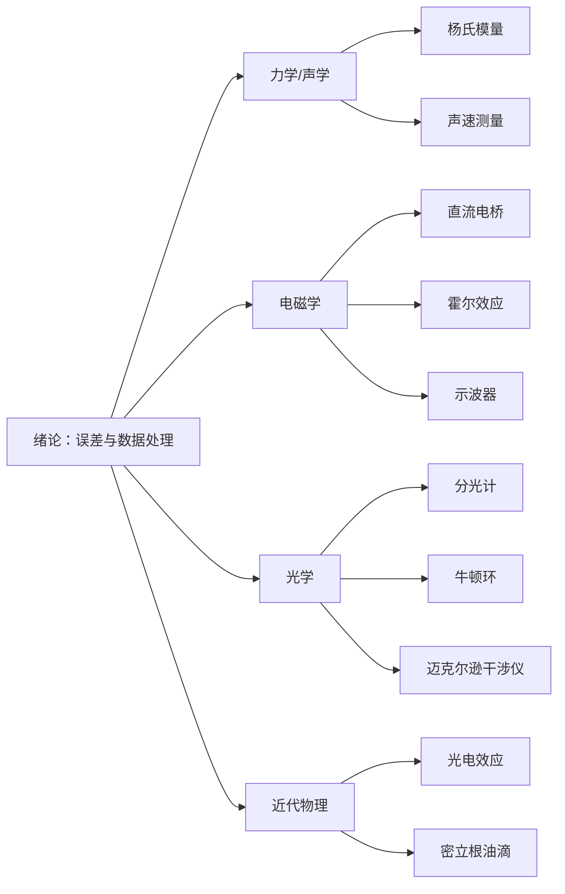

  <h1>大学物理实验</h1>
  
涵盖 10 个实验项目的课程 Wiki，兼顾考试复习与日常学习。每个实验页面采用标准实验报告结构，配有公式推导、Mermaid 原理图与思考题参考答案。

  

    ⚛ 10 个实验
    📐 标准报告结构
    ∑ 公式推导
    💡 思考题参考答案
    🌗 明暗双主题
  

  

13

页面数

  

1614

公式数

  

70

图片数

  

12

代码块

课程基础

  <a class="exp-card" href="00-绪论/">
    📚
    绪论
    误差理论 · 不确定度 · 有效数字 · 数据处理
    课程基础
  </a>
  <a class="exp-card" href="summary/">
    🗂️
    总复习
    全部实验核心公式与知识脉络汇总
    课程基础
  </a>

实验导览

  <a class="exp-card" href="01-光电效应测普朗克常数/">
    ⚡
    光电效应测普朗克常数
    爱因斯坦光电方程 · 遏止电位差
    近代物理
  </a>
  <a class="exp-card" href="02-分光计/">
    🔭
    分光计
    三重垂直调节 · 最小偏向角测折射率
    光学
  </a>
  <a class="exp-card" href="03-声速测量/">
    🌊
    声速测量
    驻波法 · 相位法 · 压电换能器
    力学 / 声学
  </a>
  <a class="exp-card" href="04-密立根油滴/">
    💧
    密立根油滴
    平衡法测电子电荷 · 斯托克斯定律
    近代物理
  </a>
  <a class="exp-card" href="05-杨氏模量/">
    📏
    杨氏模量
    光杠杆放大原理 · 逐差法
    力学 / 声学
  </a>
  <a class="exp-card" href="06-牛顿环/">
    💍
    牛顿环
    等厚干涉 · 曲率半径测量
    光学
  </a>
  <a class="exp-card" href="07-直流电桥/">
    🔌
    直流电桥
    惠斯通电桥平衡 · 双臂电桥
    电磁学
  </a>
  <a class="exp-card" href="08-示波器的使用/">
    📈
    示波器的使用
    扫描原理 · 李萨如图形
    电磁学
  </a>
  <a class="exp-card" href="09-迈克尔逊干涉仪/">
    🌈
    迈克尔逊干涉仪
    等倾干涉 · 逐差法测波长
    光学
  </a>
  <a class="exp-card" href="10-霍尔效应/">
    🧲
    霍尔效应
    霍尔系数 · 载流子浓度 · 副效应消除
    电磁学
  </a>

## 知识脉络

## 快速导航

| 实验 | 核心知识点 | 关键公式 |
|------|------|------|
| [绪论](00-绪论.md) | 误差理论、不确定度、有效数字、数据处理 | \(u=\sqrt{u_A^2+u_B^2}\) |
| [光电效应测普朗克常数](01-光电效应测普朗克常数.md) | 爱因斯坦光电方程、遏止电位差 | \(h\nu = \frac{1}{2}mv^2 + eU_a\) |
| [分光计](02-分光计.md) | 三重垂直调节、最小偏向角测折射率 | \(n = \frac{\sin\frac{A+\delta}{2}}{\sin\frac{A}{2}}\) |
| [声速测量](03-声速测量.md) | 驻波法、相位法、压电换能器 | \(v = f\lambda\) |
| [密立根油滴](04-密立根油滴.md) | 平衡法测电子电荷、斯托克斯定律 | \(q = \frac{18\pi\eta d}{\sqrt{2\rho g}}\cdot\frac{v_g}{(1+b/pa)^{3/2}}\) |
| [杨氏模量](05-杨氏模量.md) | 光杠杆放大原理、逐差法 | \(E = \frac{8FLD}{\pi d^2 K\Delta n}\) |
| [牛顿环](06-牛顿环.md) | 等厚干涉、曲率半径测量 | \(R = \frac{D_m^2 - D_n^2}{4(m-n)\lambda}\) |
| [直流电桥](07-直流电桥.md) | 惠斯通电桥平衡、双臂电桥 | \(R_x = \frac{R_1}{R_2}R_s\) |
| [示波器的使用](08-示波器的使用.md) | 扫描原理、李萨如图形 | \(f_y = \frac{N_x}{N_y}f_x\) |
| [迈克尔逊干涉仪](09-迈克尔逊干涉仪.md) | 等倾干涉、逐差法测波长 | \(\lambda = \frac{2\Delta d}{\Delta k}\) |
| [霍尔效应](10-霍尔效应.md) | 霍尔系数、载流子浓度、副效应消除 | \(R_H = \frac{1}{ne}\) |
| [总复习](summary.md) | 全部实验核心公式与知识脉络汇总 | - |

## 参考教材

- 《大学物理实验教程》，各高校物理实验教研室编
- 国家高等教育智慧教育平台（higher.smartedu.cn）精品课程
