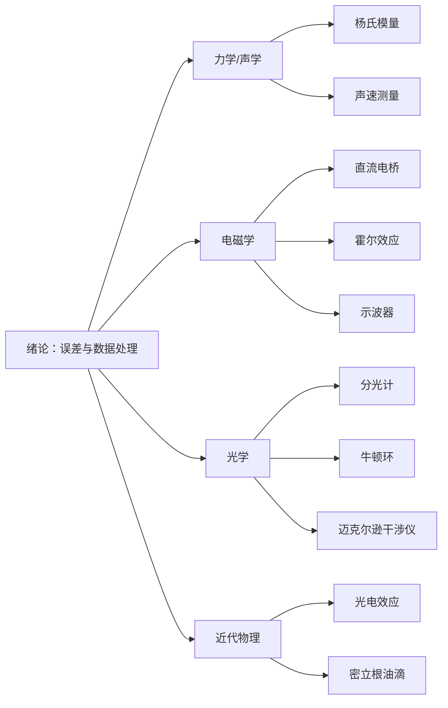

# 大学物理实验

> 本 Wiki 涵盖大学物理实验课程的 10 个实验项目，兼顾考试复习与日常学习。每个实验页面采用标准实验报告结构，配有公式推导、Mermaid 原理图和思考题参考答案。

<a class="sp-xxxl" href="00-绪论.html">绪论</a>
<a class="sp-xxl" href="01-光电效应测普朗克常数.html">光电效应</a>
<a class="sp-xxl" href="06-牛顿环.html">牛顿环</a>
<a class="sp-xl" href="02-分光计.html">分光计</a>
<a class="sp-xl" href="09-迈克尔逊干涉仪.html">干涉仪</a>
<a class="sp-xl" href="10-霍尔效应.html">霍尔效应</a>
<a class="sp-l" href="04-密立根油滴.html">密立根油滴</a>
<a class="sp-l" href="08-示波器的使用.html">示波器</a>
<a class="sp-l" href="07-直流电桥.html">直流电桥</a>
<a class="sp-m" href="03-声速测量.html">声速</a>
<a class="sp-m" href="05-杨氏模量.html">杨氏模量</a>
<a class="sp-s" href="summary.html">总复习</a>

## 知识脉络

## 快速导航

| 实验 | 核心知识点 | 关键公式 |
|------|------|------|
| [绪论](00-绪论.md) | 误差理论、不确定度、有效数字、数据处理 | \(u=\sqrt{u_A^2+u_B^2}\) |
| [光电效应测普朗克常数](01-光电效应测普朗克常数.md) | 爱因斯坦光电方程、遏止电位差 | \(h\nu = \frac{1}{2}mv^2 + eU_a\) |
| [分光计](02-分光计.md) | 三重垂直调节、最小偏向角测折射率 | \(n = \frac{\sin\frac{A+\delta}{2}}{\sin\frac{A}{2}}\) |
| [声速测量](03-声速测量.md) | 驻波法、相位法、压电换能器 | \(v = f\lambda\) |
| [密立根油滴](04-密立根油滴.md) | 平衡法测电子电荷、斯托克斯定律 | \(q = \frac{18\pi\eta d}{\sqrt{2\rho g}}\cdot\frac{v_g}{(1+b/pa)^{3/2}}\) |
| [杨氏模量](05-杨氏模量.md) | 光杠杆放大原理、逐差法 | \(E = \frac{8FLD}{\pi d^2 K\Delta n}\) |
| [牛顿环](06-牛顿环.md) | 等厚干涉、曲率半径测量 | \(R = \frac{D_m^2 - D_n^2}{4(m-n)\lambda}\) |
| [直流电桥](07-直流电桥.md) | 惠斯通电桥平衡、双臂电桥 | \(R_x = \frac{R_1}{R_2}R_s\) |
| [示波器的使用](08-示波器的使用.md) | 扫描原理、李萨如图形 | \(f_y = \frac{N_x}{N_y}f_x\) |
| [迈克尔逊干涉仪](09-迈克尔逊干涉仪.md) | 等倾干涉、逐差法测波长 | \(\lambda = \frac{2\Delta d}{\Delta k}\) |
| [霍尔效应](10-霍尔效应.md) | 霍尔系数、载流子浓度、副效应消除 | \(R_H = \frac{1}{ne}\) |
| [总复习](summary.md) | 全部实验核心公式与知识脉络汇总 | - |

## 站点统计

- 页面数： 13
- 公式数： 1614
- 图片数： 70
- 代码块： 12

## 参考教材

- 《大学物理实验教程》，各高校物理实验教研室编
- 国家高等教育智慧教育平台（higher.smartedu.cn）精品课程
