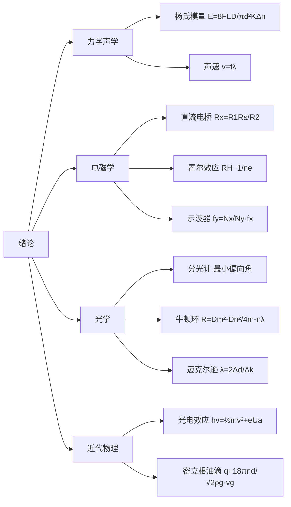

# 总复习

> 本页汇总全部 10 个实验的核心公式、知识脉络和关键概念，便于考试前快速复习。

## 知识脉络总览

## 核心公式汇总

| 实验 | 核心公式 | 物理意义 |
|------|------|------|
| 光电效应 | \(h\nu = \frac{1}{2}mv^2 + eU_a\) | 爱因斯坦光电方程，遏止电位差与频率成线性 |
| 分光计 | \(n = \frac{\sin\frac{A+\delta_{\min}}{2}}{\sin\frac{A}{2}}\) | 最小偏向角法测折射率 |
| 声速测量 | \(v = f\lambda\)，\(\lambda = 2\Delta L\) | 驻波法：相邻波腹间距为半波长 |
| 密立根油滴 | \(q = \frac{18\pi\eta d}{\sqrt{2\rho g}}\cdot\frac{v_g}{(1+\frac{b}{pa})^{3/2}}\) | 平衡法测油滴电荷，求基本电荷 e |
| 杨氏模量 | \(E = \frac{8FLD}{\pi d^2 K\Delta n}\) | 光杠杆放大法，放大倍数 \(2D/K\) |
| 牛顿环 | \(R = \frac{D_m^2 - D_n^2}{4(m-n)\lambda}\) | 等厚干涉测透镜曲率半径 |
| 直流电桥 | \(R_x = \frac{R_1}{R_2}R_s\) | 惠斯通电桥平衡条件 |
| 示波器 | \(f_y = \frac{N_x}{N_y}f_x\) | 李萨如图形测频率，\(N_x\)/\(N_y\) 为切点数比 |
| 迈克尔逊干涉仪 | \(\lambda = \frac{2\Delta d}{\Delta k}\) | 等倾干涉，动镜移动 \(\Delta d\) 对应 \(\Delta k\) 个条纹 |
| 霍尔效应 | \(R_H = \frac{1}{ne}\)，\(U_H = \frac{IB}{ned}\) | 霍尔系数与载流子浓度关系 |

## 关键常数

| 物理常数 | 符号 | 数值 |
|------|------|------|
| 普朗克常数 | \(h\) | \(6.626\times10^{-34}\,\text{J·s}\) |
| 基本电荷 | \(e\) | \(1.602\times10^{-19}\,\text{C}\) |
| 电子静止质量 | \(m_e\) | \(9.109\times10^{-31}\,\text{kg}\) |
| 光速 | \(c\) | \(3.00\times10^{8}\,\text{m/s}\) |
| 钠光波长 | \(\lambda\) | \(589.3\,\text{nm}\) |
| 氦氖激光波长 | \(\lambda\) | \(632.8\,\text{nm}\) |

## 常用数据处理方法对比

| 方法 | 适用场景 | 本课程实验 |
|------|------|------|
| 逐差法 | 自变量等间距变化 | 杨氏模量、迈克尔逊干涉仪 |
| 最小二乘法 | 线性关系拟合 | 光电效应（\(U_a\text{-}\nu\) 直线） |
| 作图法 | 直观显示关系 | 分光计、声速测量 |
| 对称测量法 | 消除系统误差（副效应） | 霍尔效应（消除不等位电势等） |
| 交换法 | 消除比例臂误差 | 直流电桥 |

## 易错点速查

> **光电效应**：遏止电位差的测定用交点法或拐点法，注意汞灯需预热 20 分钟以上，关后 5 分钟内不可重启。

> **分光计**：调节的核心是"两平行两垂直"，用各半调节法（1/2 法），双游标读数消除偏心误差。

> **声速测量**：驻波法测的是相邻波腹（或波节）间距为 \(\lambda/2\)，不是 \(\lambda\)；相位法看李萨如图形为斜直线时相位差为 0 或 π。

> **密立根油滴**：选油滴是关键，平衡电压约 200-400V，下落时间约 10-30s 为宜；斯托克斯修正项 \(1/(1+b/pa)^{3/2}\) 不可忽略。

> **杨氏模量**：光杠杆放大倍数为 \(2D/K\)（D 为镜尺距离，K 为光杠杆臂长）；加减砝码各测一次取平均消除弹性滞后。

> **牛顿环**：测量的是环的直径不是半径（避免找圆心误差）；用 \(D_m^2 - D_n^2\) 消除附加光程差 \(\lambda/2\) 的影响。

> **直流电桥**：电桥灵敏度 \(S\) 越高测量越准；交换法消除比例臂误差：\(R_x = \sqrt{R_s R_s'}\)。

> **示波器**：稳定波形需满足 \(T_x = nT_y\)（n 为整数）；李萨如图形切点数比 \(N_x:N_y = f_y:f_x\)。

> **迈克尔逊干涉仪**：等倾条纹为同心圆环，动镜移动 \(\lambda/2\) 吞吐一个条纹；读数注意三个尺（粗调、微调、估读）。

> **霍尔效应**：用对称测量法（改变电流和磁场方向）消除四种副效应；霍尔电压方向判断载流子类型（N 型为电子，P 型为空穴）。
